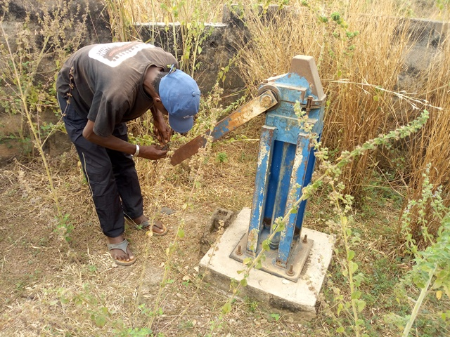

template: article
title: Golikro
slug: golikro
idbdd: Golikro
tags: Rural
authors: BROU Yves Oscar Kouadio, SORO Doba, MAILLARD Thomas, DIAKITE A. Cheick, KOHE A. Christelle, OUATTARA Mafine, SERI A. Jonathan, N'GUESSAN Firmain Kouakou
date: 2019-01-18
latitude: 7.76651
longitude: -5.01059
zoom: 16
localisation: Nord de Bouaké

|Informations générales||
|:--|--:|
| Nom de la localité : | Golikro | 
| Population : | 1000 habitants | 
| Dessertes en eau potable | Totalement raccordé au réseau SODECI | 
| Gestion des excrétas | Assainissement autonome | 

## Présentation de la localité
Situé à la sortie nord de la commune de Bouaké, le village de Golikro se trouve à environ 4 kilomètres du centre-ville de Bouaké. Il appartient au canton de Konankankro. Il est accessible par une route à deux voies en terre battue. Le village compte environ un millier d'habitants.

Golikro dispose d’une école de 6 classes et bientôt d’un centre de santé communautaire en cours de construction.

On y retrouve essentiellement des habitations de tous types : des habitations en parpaings, en terre ou en ciment avec des tôles ondulées. 

Il n'y a pas de système de gestion des ordures ménagères, aussi celles-ci sont déposées en marge du village à la lisère de la forêt. Les habitations sont rarement équipées de latrines, aussi les habitants pratiquent la défécation à l'air libre à l'écart des habitations.

L'activité principale du village est l'agriculture vivrière (igname, manioc, riz et autres productions maraîchères tomates, piments et aubergines) et la culture de rente de l'anacarde. Les femmes du village transforment le manioc en attiéké dans de petites unités de production familiales. Chaque ménage élève quelques moutons ou quelques chèvres. Durant la saison des pluies, les animaux sont gardés dans des enclos pour qu'ils ne divaguent pas dans les espaces cultivés.

La mutuelle des cadres ressortissants du village occupe une place importante dans le financement des projets de développement local, surtout dans l’accès à l’eau potable.

## Socio anthropologie de la localité

Minankro est peuplé par les Phali, un sous-groupe Baoulé. L'organisation sociale du village est similaire à l'organisation classique des communautés villageoises Baoulé. Les affaires du village sont gérées par les notables formant une chefferie hiérarchisée qui intègre aussi des représentants des organisations de femmes et de jeunes. La chefferie intervient dans le règlement des conflits (intracommunautaires et extracommunautaires) et joue un rôle d'interface entre la communauté villageoise et les administrations publiques et collectivités territoriales. 

 Les habitants sont majoritairement issus des lignages fondateurs du village et les ménages sont constitués de famille nucléaire associant parfois des membres collatéraux (parents, cousins ou fratrie célibataire). Les tâches ménagères et en particulier l'approvisionnement en eau du ménage demeure l'apanage des femmes.

## État des lieux des ouvrages d’alimentation en eau potable

### Ouvrages existants
Le village de Golikro est connecté au réseau de distribution d’eau de la SODECI depuis 2016 et compte à ce jour une trentaine de concessions abonnées. En matière d’infrastructures d’hydraulique villageoise, Golikro compte actuellement 3 forages équipés de pompes à motricité humaine (PMH), dont 1 seul fonctionnel au moment des enquêtes. Le village compte également quelques puits traditionnels et des marigots.
La seule pompe fonctionnelle (Type Vergnet HPV 60) est celle de l’école. Elle a été construite par la mutuelle de développement du village à l’origine pour les instituteurs. Mais elle sert de source d’AEP en cas de rupture sur le réseau de la SODECI dans le village et ceux avoisinants (Kouadiomiankro et Andonsakassou). Quant aux 2 PMH non fonctionnels : ABI 1 et Vergnet HPV 100, elles sont en panne respectivement depuis 8 ans et 5 ans. L’enquête sanitaire réalisée autour de la pompe de l’école révèle une faible vulnérabilité du point d’eau par rapport aux sources de contamination. L’analyse de l’échantillon d’eau prélevé indique un taux de fluor élevé par rapport à la norme recommandée (1,5 mg/l).
Quant aux puits traditionnels, ils ont une profondeur moyenne de 6 mètres et tarissent tous pendant la saison sèche. L’enquête sanitaire autour de 2 puits du village indique un risque élevé au niveau des 2 puits  et une contamination à la bactérie *E coli*, des concentrations élevées en fluor pour les 2 puits analysés et un taux de nitrate supérieur à 50 mg/l dans un des puits.

### Pratiques et modes d’approvisionnement en eau
Le village étant connecté au réseau de la SODECI, les modes d’approvisionnement dépendent de la disponibilité des compteurs et de la perception de la qualité de l’eau de la SODECI.
Les habitations abonnées au réseau de distribution utilisent l’eau pour toutes les tâches domestiques et la boisson. Cependant, lorsque la qualité de l’eau au robinet est jugée insatisfaisante par les ménages, elle est utilisée pour les autres besoins domestiques et l’eau des forages est alors utilisée pour la consommation.
L’eau des forages sert à tous les usages notamment au sein des ménages ne disposant pas de compteurs.
Les puits et le marigot servent principalement aux tâches domestiques (la lessive principalement pour le marigot) mais peuvent parfois servir à la boisson en cas de longue pénurie et de panne de la pompe.

### Gestion des points d’eau

Les points d’eau équipés de pompes (PMH) sont communautaires. Cependant, il n’y a pas de comité de gestion spécifique, c’est la mutuelle du village qui finance les réparations, lorsqu’elle le peut. 

Les puits relèvent de la responsabilité de leur propriétaire.

Le marigot ne fait l’objet d’aucun entretien particulier.

## Personnes ressources

* Chef de village Golikro
* Porte-canne du chef de village
* Présidente des Femmes 
* Président de la mutuelle

## Assainissement et gestion des excrétas

Le village de Golikro ne dispose d’aucun réseau de drainage et d’évacuation des eaux pluviales et des eaux usées domestiques.

Les ordures sont évacuées et stockées dans un dépotoir situé à l’écart des habitations en lisière de forêt.

Les habitations sont rarement équipées de latrines, quelques-unes disposent de latrines sèches ou de latrines à eau. La majorité des habitants pratique donc la défécation à l’air libre.

## Desiderata des populations

| Type d'entretien | Date | 
| :-- | :--: | 
| Entretien individuel Chef de village Golikro|18 janvier 2019| 
| Entretien individuel Présidente des Femmes Golikro|18 janvier 2019|
| Entretien individuel Présidente du comité de gestion Golikro|18 janvier 2019| | 
| Focus group hommes Golikro|18 janvier 2019|
| Focus group femmes Golikro|18 janvier 2019|  

Les habitants souhaitent disposer de plusieurs forages ou puits communautaires équipés de pompes (PMH) en état de marche. Ils privilégient ce type d’équipement, car il les rend autonomes en cas de coupure de l’eau du robinet distribuée par la SODECI. En outre, les PMH offrent un meilleur confort d’usage que les puits. 

## Tensions ressenties lors des entretiens

### Tensions générales
Il n'y a pas de tensions notables entre les habitants. Les tensions locales sont généralement encadrées par la notabilité qui fait respecter un ensemble de règles de vie assorties de sanctions (amendes en nature, bannissement) en cas de désobéissance.

### Tensions autour de l'eau
Du fait de la rareté des points d’eau communautaires (1 pompe fonctionnelle pour près de 1000 habitants), des disputes éclatent dans la file d’attente, toutefois celles-ci demeurent ponctuelles et de faible ampleur.

### Tensions avec les localités voisines
En cas de coupure de l'eau du robinet, les villages voisins de s'approvisionnent à la pompe située à côté de l'école primaire. Or, si l'école accueille des enfants des villages environnants, la pompe a été payée et construite par la mutuelle de Golikro, aussi les habitants de Golikro considèrent qu'ils sont prioritaires. Il leur arrive de verrouiller la pompe afin qu'elle ne soit plus accessible aux habitants des autres villages. Cela crée un climat de tension entre les villages en période de pénurie.
