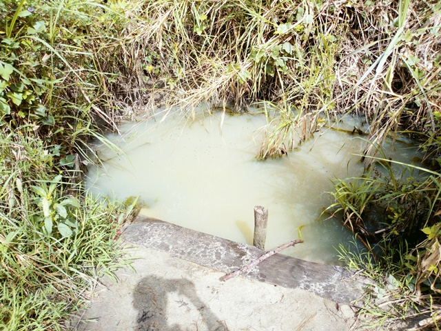

template: article
title: Ahougnanou
slug: ahougnanou
iddbb:Ahougnanou
tags: Rural
authors: BROU Yves Oscar Kouadio, SORO Doba, MAILLARD Thomas, DIAKITE A. Cheick, KOHE A. Christelle, OUATTARA Mafine, SERI A. Jonathan, N'GUESSAN Firmain Kouakou
date: 2019-02-21
latitude:  7.71542
longitude: -5.11185 
zoom: 16
localisation: Ouest de Bouaké

|Informations générales||
|:--|--:|
| Nom de la localité : | Ahougnanou | 
| Population : | 600 habitants | 
| Dessertes en eau potable | Non raccordé au réseau SODECI | 
| Gestion des excrétas | Assainissement autonome |
 

## Présentation de la localité
Ahougnanou est un village de la Sous-préfecture de Bouaké dans la direction ouest de la ville de Bouaké, il est accessible par une route carrossable en terre battue. Il compte plus de 600 habitants. 

Ahougnanou n’abrite ni école primaire, ni centre de santé, ni point de collecte des ordures et n'est relié à aucun réseau technique (eau potable ou électricité).

Les habitations dans le village sont faites pour la majorité en brique de terre battue et couverte de tôles ou de pailles. Néanmoins, on peut observer quelques maisons faites en briques de ciment. La plupart des habitations ne sont pas équipées de latrines et les habitants pratiquent la défécation à l'air libre en lisière du village.

À l’image de la plupart des villages du centre de la Côte d’Ivoire, les populations d’Ahougnanou ont comme principales activités économiques l’agriculture. Elles pratiquent la culture de l’anacarde comme cultures d’exportations et le riz, l’igname, etc. comme cultures vivrières. 

## État des lieux des ouvrages d’alimentation en eau potable

### Ouvrages existants
Le village compte 2 sources principales d’approvisionnement en eau:

 1 forage équipé de PMH qui sert à la boisson et aux travaux ménagers et 1 marigot utilisé pour certaines tâches ménagères et l’arrosage des jardins. 
 
 
 **La pompe**
 
 
 
 
 
 
 
 **le marigot**
 
 
 
 
 Depuis son installation en 2013 par le Programme présidentiel d’Urgence (PPU) la pompe est tombée en panne 3 fois avec des pannes au moteur qui ne fournit pas une pression suffisante. Toutefois, la pompe est toujours opérationnelle, toutefois, elle ne délivre pas beaucoup de pression et ne peuvent couvrir les besoins de toute la population du village. Les paramètres organoleptiques révèlent que l’eau de la pompe a un gout salé. On note par ailleurs la présence de colonie de *E. coli* dans les deux sources:
 
 
* 1 UFC/100ml pour la pompe 
* 97 UFC/100ml pour le marigot

3 habitations disposent aussi de puits privés.

### Pratiques et modes d’approvisionnement en eau

La population de Ahougnanou s'approvisionne majoritairement à la PMH.  En cas de pannes, les populations ont recours aux marigots et aux puits ou aux pompes des villages voisins.

### Gestion des points d’eau

La surveillance, l'entretien et le recueil des cotisations relatives à la pompe communautaire du village sont réalisés par chaque famille du village à tour de rôle. Cette gestion est organisée et encadrée par une femme du village. L'argent recueilli est géré par le président des jeunes du village. Une cuvette d'eau coûte 10 francs.

## Personnes ressources

* Chef de village 
* Présidente des Femmes

## Gestion des excrétas
À Ahougnanou, les règles d’hygiène et d’assainissement sont difficilement respectées.  La majeure partie des concessions traditionnelles ne dispose pas de latrines conventionnelles. La défécation se fait soit à l’air libre dans le village ou autour, soit dans des latrines traditionnelles peu respectueuses des règles d’hygiène. Seules les concessions modernes disposent de latrines à fosse septique. Pour ce qui concerne la gestion des ordures ménagères, il n’existe pas un système propre au village. Les déchets ménagers sont collectés et déversés en brousse

## Desideratas des populations
| Type d'entretien | Date | 
| :-- | :--: | 
| Entretien individuel Chef de village |21 Fevrier 2019| 
| Entretien individuel présidente des femmes |21 Fevrier 2019|  
| Focus group femmes |21 Fevrier 2019| 

Les habitants souhaiteraient avoir une pompe de plus pour compenser les faiblesses de la pompe existante.

## Tensions ressenties lors des entretiens

### Tensions généraux
Aucune tension signalée

### Tensions autour de l'eau
Malgré la rareté des points d'eau dans ce village, aucune tension n'a été signalée.

### Tensions avec les localités voisines
Aucune tension signalée.

