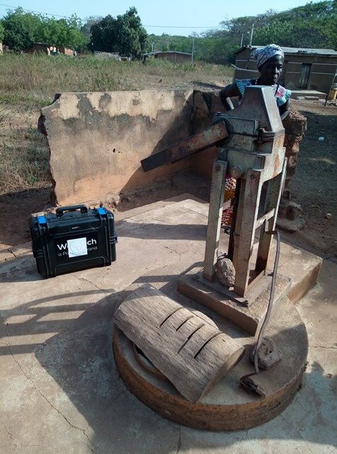

template: article
title: Ahoussi Takikro
iddbb: Ahossi Takikro
slug: ahossitakikro
tags: Rural
authors: BROU Yves Oscar Kouadio, SORO Doba, MAILLARD Thomas, DIAKITE A. Cheick, KOHE A. Christelle, OUATTARA Mafine, SERI A. Jonathan, N'GUESSAN Firmain Kouakou
date: 2019-05-08
latitude: 7.85817
longitude: -5.0324
zoom: 16
localisation: Nord de Bouaké

|Informations générales||
|:--|--:|
| Nom de la localité : | Ahoussi Takikro | 
| Population : | 500 habitants | 
| Dessertes en eau potable | Non raccordé au réseau SODECI | 
| Gestion des excrétas | Assainissement autonome | 

## Présentation de la localité
Ahoussi-Takikro est un village de la Sous-préfecture de Bouaké situé au nord-est à environ une quinzaine de kilomètres de la ville, dans le canton de Konankro. Peuplé de plus de 500 habitants, ce village abrite une école primaire, mais pas de centre de santé. Le village est relié au réseau électrique. Celui de la SODECI n’est pas encore disponible dans le village. 
En ce qui concerne la typologie d’habitat que l’on retrouve à Ahoussi-Takikro, elle est plutôt sous un traditionnel avec des maisons construites en terre battue et en banco. 
Les activités génératrices de revenus sont généralement axées sur l’agriculture avec une production d’anacarde comme culture de rente et le riz et l’igname comme cultures vivrières

## Socio anthropologie de la localité 

Ahoussi Takikro est un village habité par les Baoulés phali. Le village est administré par une autorité traditionnelle, le chef de village, des notables et des présidents de jeunesse et de femme.

## État des lieux des ouvrages d’alimentation en eau potable
### Existants
Le village compte 2 forages équipés de pompe à motricité humaine (PMH). Sur ces 2 pompes, 1 seule est fonctionnelle et date de 1998. La plus ancienne des pompes, créée en 1978, est en panne et souffre des tuyaux percés à l’intérieur de la pompe depuis 3 ans. Les deux pompes sont des pompes communautaires offertes par l’État. La pompe fonctionnelle est tombée en panne une seule fois depuis son implantation. On note une forte pression sur la pompe fonctionnelle, car elle est la seule source d’approvisionnement en eau du village.

L’enquête sanitaire réalisée au niveau du forage indique que ce point d’eau présente un risque pour la santé des populations. Les analyses de la qualité de l’eau révèlent l’absence d’une pollution azotée dans les échantillons d’eau. Cependant les analyses bactériologiques des eaux ont révélé la présence de *E. coli* dans l’eau du forage (25 UFC/ml). 
Au regard de tout ce qui précède, notons que ce village est assez vulnérable au stress hydrique. 

### Pratiques et modes d’approvisionnement en eau
À Ahossi-Takikro, les sources d’eau sont une PMH et 4 marigots. Il n’y a pas de véritable régulation en ce qui concerne le mode d’approvisionnement. Les sources d’eau étant tout le temps disponibles et ouvertes, chaque habitant s’approvisionne selon ses besoins. 

### Gestion des points d’eau
Il n’y a pas de comité de gestion des points d’eau à Ahossi Takikro. Le président des jeunes et la présidente des femmes sont ceux qui, parfois, essaient de superviser  la pompe. De plus, lorsque la PMH tombe en panne, une cotisation  est rarement levée par le chef de village pour les réparations. Sinon, un volontaire se charge de la réparation en cas de panne. 
En ce qui concerne les marigots, c’est uniquement lorsque ceux-ci tarissent qu’il y a une mobilisation des jeunes du village pour les creuser davantage en espérant avoir de l’eau.

## Personnes ressources

* Chef de village 
* Président des Femmes 

## Gestion des excréta
À Ahossi-Takikro, on observe un faible niveau d’hygiène et d’assainissement. La majeure partie des concessions ne dispose pas de latrine. La défécation se fait donc à l’air libre dans le village ou dans les broussailles environnant le village. Pour ce qui concerne la gestion des ordures ménagères, il n’existe pas un système propre au village. Les déchets ménagers sont collectés et déversés en brousse. 

## Desiderata des populations

| Type d'entretien | Date | 
| :-- | :--: | 
| Entretien individuel Chef de village |12 février 2019| 
| Entretien individuel Président des Femmes|12 février 2019| 
| Entretien individuel Présidente du comité de gestion|12 février 2019| 
| Focus group hommes |12 février 2019| 
| Focus group femmes |12 février 2019| 

Les populations demandent l’installation d’autres pompes et la réparation de la pompe endommagée.

## Tensions ressenties lors des entretiens

### Tensions générales
Aucune tension signalée

### Tensions autour de l'eau
Du fait de la rareté des points d’eau communautaires, des disputes éclatent dans la file d’attente, toutefois celles-ci demeurent ponctuelles et de faible ampleur.

### Tensions avec les localités voisines
Aucune tension signalée. 

