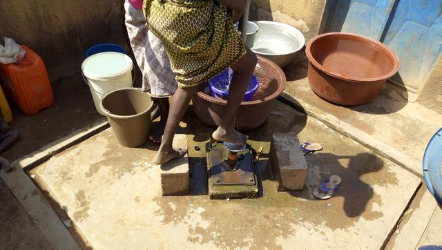

template: article
title: Akakro
iddbb: Akakro
slug: akakro
tags: Rural
authors: BROU Yves Oscar Kouadio, SORO Doba, MAILLARD Thomas, DIAKITE A. Cheick, KOHE A. Christelle, OUATTARA Mafine, SERI A. Jonathan, N'GUESSAN Firmain Kouakou
date: 2019-05-07
latitude: 7.8295
longitude: -5.01331
zoom: 16
localisation: Nord de Bouaké

|Informations générales||
|:--|--:|
| Nom de la localité : | Akakro | 
| Population : | 800 habitants | 
| Dessertes en eau potable | Non raccordé au réseau SODECI | 
| Gestion des excrétas | Assainissement autonome | 

## Présentation de la localité
Le village d’Akakro est situé au nord de la ville de Bouaké à environ 9 kilomètres. Il est accessible par une large route en terre battue. Le village dispose d’une école de 6 classes, d’un centre de santé, mais n’est pas alimenté par le réseau de la SODECI. La taille de la population du village est estimée à environ 800 habitants. 

Ce village est subdivisé en 4 sous-quartiers dont N’drikro 1, N’drikro 2 et Kouassikro et Kouadio Kouakoukro. La typologie d’habitat que l’on retrouve dans ce village s’apparente à un style plutôt mixte avec des maisons construites en dur et des maisons en banco. Les concessions modernes appartiennent, pour la plupart, à des cadres du village travaillants en ville et autres retraités.  Les activités génératrices de revenus sont généralement axées sur l’agriculture avec une production d’anacarde comme culture de rente et le riz, l’igname etc. comme cultures vivrières. Le village renferme des carrières de sable qui font l’objet d’exploitation par des structures privées.

## Socio anthropologie de la localité 
Une vie communautaire structurée  autour du chef central de communauté, Akakro est un village entièrement peuplé par les Baoulés. Les quelques étrangers que l’on retrouve sont des fonctionnaires (enseignants, corps médical). Le village a bénéficié de profilage de la route à cause des activités d’une carrière qui est située dans la zone.

## État des lieux des ouvrages d’alimentation en eau potable
### Existants
Nous avons identifié 2 sources principales d’approvisionnement en eau de consommation : les forages et les marigots. Le forage est la principale source d’approvisionnement en eau de boisson pour cause de la qualité. Il sert pour tous les usages. Le forage est entretenu de façon irrégulière et présente régulièrement des pannes mineures. Il tombe en panne en moyenne 1 fois par an. La qualité de l’eau est jugée acceptable par les populations et l’analyse de l’eau n’a pas révélé des anomalies particulières.

Les enquêtes ont porté sur le marigot du village. L’eau du marigot est utilisée pour la lessive et le bain dans plusieurs concessions familiales.

Les analyses des paramètres physiques de l’eau de la pompe ont démontré que l’eau avait un pH acide (6.23 et 5.45). Quant aux paramètres chimiques, ils ont démontré une forte concentration en fluor (1.2 et 1.8 mg/l). Les paramètres microbiologiques ont révélé une contamination de l’eau du marigot par les colonies de *E. coli* (100 UFC/100ml). Ces points d’eau ont une note d’évaluation de vulnérabilité estimée à (2) pour le marigot et (1) pour le forage. Ces valeurs indiquent un niveau de vulnérabilité faible au niveau de ces points d’eau.

### Pratiques et modes d’approvisionnement en eau
L’eau du forage sert à tous les usages domestiques des ménages. L’eau des marigots est utilisée en compensation en cas de panne de la pompe.

### Gestion des points d’eau
La gestion du forage est assurée par un comité de gestion dirigé par une femme du village. Cette dernière est chargée de veiller sur les différents passages, mais aussi de collecter les frais des différentes prestations. L’eau est vendue dans le village à 10 FCFA la bassine. 

## Gestion des excréta
Akakro est vulnérable au niveau de l’hygiène et de l’assainissement. La majeure partie des concessions ne disposent pas de latrine. La défécation à l’air libre continue donc de se faire dans le village. Pour ce qui concerne la gestion des ordures ménagères, il n’existe pas un système propre au village. Les déchets ménagers sont collectés et déversés en brousse. 

## Desideratas des populations
| Type d'entretien | Date | 
| :-- | :--: | 
| Entretien individuel Chef de village |15 février 2019| 
| Entretien individuel Président des Femmes|15 février 2019| 
| Entretien individuel Présidente du comité de gestion|15 février 2019| 
| Focus group hommes |15 février 2019| 
| Focus group femmes |15 février 2019| 

Face aux problèmes rencontrés dans l’approvisionnement en eau, les populations demandent l’installation d’autres pompes, car elles estiment que celle qui existe déjà est insuffisante. 

## Tensions ressenties lors des entretiens

### Tensions générales
Aucune tension signalée

### Tensions autour de l'eau
Du fait de la rareté des points d’eau communautaires, des disputes éclatent dans la file d’attente, toutefois celles-ci demeurent ponctuelles et de faible ampleur.

### Tensions avec les localités voisines
Aucune tension signalée.

