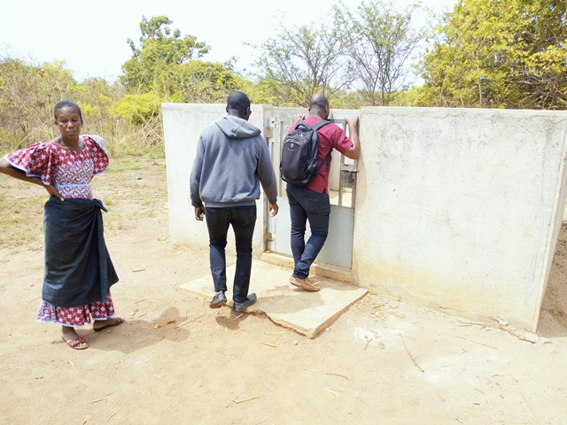

template: article
title: Allokokro
slug: allokokro
iddbb: Allokokro
tags: Rural
authors: BROU Yves Oscar Kouadio, SORO Doba, MAILLARD Thomas, DIAKITE A. Cheick, KOHE A. Christelle, OUATTARA Mafine, SERI A. Jonathan, N'GUESSAN Firmain Kouakou
date: 2019-02-20
latitude:  7.73170
longitude: -5.09162 
zoom: 16
localisation: Nord de Bouaké, en bordure de l'aéroport

|Informations générales||
|:--|--:|
| Nom de la localité : | Allokokro | 
| Population : | 1000 habitants | 
| Dessertes en eau potable | Non raccordé au réseau SODECI | 
| Gestion des excrétas | Assainissement autonome |

## Présentation de la localité
Le village d’Allokokro est situé sur l’axe Bouaké - Botro en limite de Bouaké. Le village est limitrophe de l'aéroport, c'est pourquoi, en raison d'un projet d'extension de cet équipement majeur, il est en cours de délocalisation vers un nouveau site. 

Le village compte environ 1000 habitants. Le village n’est pas raccordé au réseau de la SODECI. Le nouveau site du village possède une école où il n’y a pas de point d’eau. 

Les habitations sont modernes faites en briques de ciment couvertes de tôles ondulées. 

Les activités génératrices de revenus sont généralement axées sur l’agriculture avec une production d’anacarde comme culture de rente et le riz, l’igname, etc. comme cultures vivrières, mais aussi des restaurants et hôtel du fait de sa proximité avec la ville de Bouaké.

## État des lieux des ouvrages d’alimentation en eau potable

### Ouvrages existants
Le réseau de la SODECI passe à proximité du village, mais celui-ci n’a pas été raccordé.

Le nouveau site du village dispose d’un forage équipé d'une pompe à motricité humaine de type Vergnet HPV 100. Celle-ci a été installée par la coopération japonaise (JICA). Elle est installée près de l’école et sa gestion est pour le moment confiée à l’école en attendant l’arrivée de tous les villageois.

La pompe est très bien entretenue et l’analyse de la qualité de l’eau n’indique aucune anomalie au niveau de tous les paramètres analysés.

### Gestion des points d’eau

La gestion de la nouvelle pompe est confiée à l'école primaire.

## Personnes ressources

* Chef de village

## Gestion des excrétas
La gestion des excrétas se fait de manière autonome, nous avons rencontré tous les types de latrines : fosses septiques, à fosses simples sur le nouveau site du village.

## Desideratas des populations
| Type d'entretien | Date | 
| :-- | :--: | 
| Entretien individuel Chef de village |20 Février 2019| 
| Entretien individuel Président des Femmes| 2019| 
| | Focus group hommes |20 Fevrier 2019| 
| Focus group femmesMinakro|20 Fevrier 2019| 

Les villageois souhaiteraient obtenir une ou plusieurs pompes en plus de la pompe existante.

## Tensions ressenties lors des entretiens

### Tensions générales
La communauté villageoise est en conflit avec les autorités dans le cadre du **projet d'extension de l'aéroport** de Bouaké. Ce conflit touche aux dédommagements des préjudices causés par le déplacement de l'ensemble du village sur un autre site.

### Tensions autour de l'eau
Aucune tension signalée

### Tensions avec les localités voisines
Aucune tension signalée

