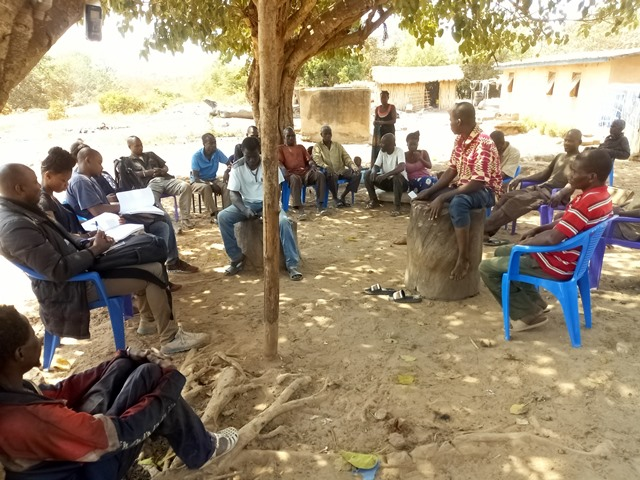

template: article
title: Allomabo
slug: allomanbo
iddbb: Allomabo
tags: Rural
authors: BROU Yves Oscar Kouadio, SORO Doba, MAILLARD Thomas, DIAKITE A. Cheick, KOHE A. Christelle, OUATTARA Mafine, SERI A. Jonathan, N'GUESSAN Firmain Kouakou
date: 2019-02-01
latitude:  7.77227
longitude: -4.89100
zoom: 16
localisation: Nord-Est de Bouaké, sur la route de Bassawa

|Informations générales||
|:--|--:|
| Nom de la localité : | Allomabo | 
| Population : | > 1000 habitants | 
| Dessertes en eau potable | Non raccordé au réseau SODECI | 
| Gestion des excrétas | Assainissement autonome |

## Présentation de la localité
Le village d’Allomabo est situé à environ 10 kilomètres de Bouaké. Il compte plus 1000 habitants et  dispose d’une école primaire, mais d'aucun centre de santé. Les habitants du village se rendent dans la commune de Bouaké notamment à Belleville pour les problèmes de sanitaires. Le village d’entend maintenant sur 2 sites : l’ancien village et le nouveau village où l’école est construite.

On y retrouve essentiellement des habitations de tous types : parpaings, terre, ciment avec des tôles ondulées. On note aussi la présence de cases en banco, mais en de faibles proportions. L'agriculture est l'activité principale : l’igname, le manioc, l’anacarde et les produits maraichers (tomate, piment, aubergine).

En ce qui concerne les infrastructures, le village ne dispose pas de point de collecte d’ordures ménagères. Cette situation oblige la communauté à  déverser les ordures ménagères dans la forêt juste derrière le village. De plus, il faut noter que la majorité des villageois ne disposent pas de toilettes dans leurs maisons et vont faire leur besoin dans la forêt. On observe également des excréments d’animaux partout dans le village et en particulier à proximité des points d’eau.

## Socio anthropologie de la localité 

Le village est habité par les Baoulés phali, sous-groupe du peuple Akan. Le village est régi par une autorité traditionnelle composée d’un chef de village, de plusieurs notables, de deux présidents de jeunesse (homme et femme). Le chef  du village est l’autorité exécutive en charge de la prise de décision dans le village. Celui-ci est accompagné par les notables qui font office de conseillers. Quant aux présidents de jeunesses, ceux-ci sont responsables de l’intégration communautaire des membres à travers des activités festives et ludiques. Ils interviennent aussi dans la médiation des conflits communautaires.

## État des lieux des ouvrages d’alimentation en eau potable

### Ouvrages existants
Le village n’est pas raccordé au réseau de la SODECI.

En ce qui concerne l’hydraulique villageoise, le village compte 1 seule pompe à motricité humaine fonctionnelle (PMH) de type ABI 1.  Ce point d’eau a été construit en 1978. La pompe tombe régulièrement en panne : 6 pannes en 2018. Les tuyaux sont vétustes et donnent un gout ferreux désagréable à l’eau lorsqu’elle est utilisée pour la  boisson. Le point d’eau est très bien entretenu et l’analyse des paramètres physicochimiques et bactériologiques n’a révélé aucune pollution des prélèvements.

Le village compte aussi 2 puits traditionnels qui tarissent en saison sèche. Ils avaient tous les deux tari lors des enquêtes dans le village en février 2019.

L’eau du réservoir de barrage est utilisée pour les activités domestiques, mais pas pour la boisson. Des cas de **bilharziose** ont été signalés dans le village. 

L’école située à plus d’un kilomètre de l’ancien village n’a pas encore de point d’eau.

### Gestion des points d’eau

Le point d’eau (PMH) est géré par un comité composé de sept personnes, dont une femme. Ce comité est chargé d’ouvrir la pompe les matins et de réguler tout le processus d’approvisionnement. Le comité encaisse également un montant forfaitaire (10 francs/cuvette) et le reverse dans la caisse prévue à cet effet. Cet argent est généralement utilisé pour les éventuelles réparations de la pompe. En plus de la PMH, il y a de nombreux puits au village, qui servent à la boisson et aux autres taches ménagères. Il est également important de préciser que le village d’Allomabo a un lac. Celui-ci est essentiellement utilisé par la lessive.

## Personnes ressources

* Chef de village 
* Président des Femmes 
* Présidente du comité de gestion

# Gestion des excrétas

Le niveau d’assainissement à Allomabo est faible. En effet, l’on remarque des ordures ménagères dans le village et aux alentours.  L’absence de point de collecte d’ordures et de poubelles contribue également à l’insalubrité du village. De plus, nous constatons que les habitants défèquent à l’air libre. Ceci s’observe par la présence d’excréments au sein du village. Les animaux également, sans enclos, défèquent dans tout le village.

## Desideratas des populations
| Type d'entretien | Date | 
| :-- | :--: | 
| Entretien individuel Chef de village|01 février 2019| 
| Entretien individuel Président des Femmes|01 Février 2019| 
| Entretien individuel Présidente du comité de gestion|01 Février 2019| 
| Focus group hommes |01 Février 2019| 
| Focus group femmes |01 Février 2019| 

Les habitants souhaiteraient que leur forage soit réhabilité et qu'un nouveau forage équipé d'une pompe soit construit dans le village.

## Tensions ressenties lors des entretiens

### Tensions générales
Aucune tension signalée

### Tensions autour de l'eau
Du fait de la rareté des points d’eau communautaires, des disputes éclatent dans la file d’attente, toutefois celles-ci demeurent ponctuelles et de faible ampleur.

### Tensions avec les localités voisines
Aucune tension signalée.
