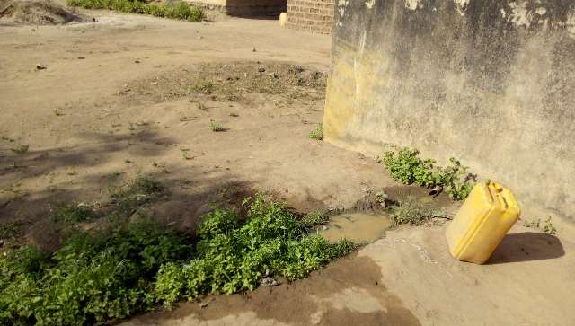

template: article
title: Angankro
iddbb: Angankro
slug: angankro
tags: Rural
authors: BROU Yves Oscar Kouadio, SORO Doba, MAILLARD Thomas, DIAKITE A. Cheick, KOHE A. Christelle, OUATTARA Mafine, SERI A. Jonathan, N'GUESSAN Firmain Kouakou
date: 2019-05-07
latitude: 7.78182
longitude: -5.05413
zoom: 16
localisation: Nord de Bouaké

|Informations générales||
|:--|--:|
| Nom de la localité : | Angankro | 
| Population : | 450 habitants | 
| Dessertes en eau potable | Pas raccordé au réseau SODECI | 
| Gestion des excrétas | Assainissement autonome | 

## Présentation de la localité
Le village d’Angankro est situé au nord de la ville de Bouaké à environ 5 kilomètres, n'est accessible que par une piste étroite (permettant le passage d'une moto seulement). Aujourd’hui, la population du village est estimée à environ 450 habitants. 

Au niveau des infrastructures de base, Angankro ne dispose pas d’écoles et de Centre de santé. En ce qui concerne la typologie d’habitat que l’on retrouve à Angankro, elle est plutôt sous un style traditionnel avec des maisons construites en banco pour certains et d’autres avec des briques en terre battue. 

Le village ne dispose pas d’école primaire et centre de santé communautaire. La population se rend dans le village  de Bamoro pour les problèmes sanitaires et dans le village voisin d’Akpôkro pour la scolarisation des enfants.

Il n'y a pas de système de gestion des ordures ménagères, aussi celles-ci sont déposées en marge du village à la lisère de la forêt. Les habitations sont rarement équipées de latrines, aussi les habitants pratiquent la défécation à l'air libre à l'écart des habitations.

L'activité principale du village est l'agriculture vivrière (igname, manioc, riz et autres productions maraîchères tomates, piments et aubergines) et la culture de rente de l'anacarde. Les femmes du village transforment le manioc en attiéké dans de petites unités de production familiales et commercialisent leurs productions au marché de Bamoro. Chaque ménage élève quelques moutons ou quelques chèvres. Durant la saison des pluies, les animaux sont gardés dans des enclos pour qu'ils ne divaguent pas dans les espaces cultivés.

## Socio-Anthropologie

KAngankro est un village habité par les Baoulés Fahafouè.  L'organisation sociale du village est similaire à l'organisation classique des communautés villageoises Baoulé. Les affaires du village sont gérées par les notables formant une chefferie hiérarchisée qui intègre aussi des représentants des organisations de femmes et de jeunes. La chefferie intervient dans le règlement des conflits (intracommunautaires et extracommunautaires) et joue un rôle d'interface entre la communauté villageoise et les administrations publiques et collectivités territoriales.

Ce village est particulièrement enclavé et isolé, en conséquence il présente un retard important en matière d'équipement.

## État des lieux des ouvrages d’alimentation en eau potable

### Ouvrages existants
Le village d’Angankro dispose de 2 forages dont 1 seul est en fonction. Seule source d'approvisionnement, ce forage est usé. En effet, datant de 1997, ce dernier tombe en panne en moyenne 3 à 4 fois par an. Son entretien n’est pas régulier ce qui le rend encore plus vulnérable.

Toutefois, l’enquête sanitaire réalisée au niveau du forage indique que ce point d’eau ne présente pas de risques pour la santé des populations. Les analyses de la qualité de l’eau révèlent l’absence de pollution azotée dans les échantillons d’eau. Cependant les différents tests physico-chimiques indiquent la présence du fluor en des concentrations relativement élevées (1,4 mg/L) proche du seuil admissible pour l’eau de boisson. L’analyse bactériologique des eaux n’a révélé aucune trace de *E. coli* dans l’eau du forage. 
Au regard de tout ce qui précède, notons que Angankro est un village assez vulnérable face au stress hydrique. 

### Pratiques et modes d’approvisionnement en eau
L’eau du forage sert à tous les usages domestiques des ménages étant donné qu’elle est la seule source du village. Les marigots tarissent très rapidement pendant la saison sèche.

###Gestion des points d’eau
La gestion du forage est assurée par un comité de gestion constitué de femmes du village. Elles assurent la surveillance et l’entretien aux alentours de la pompe. Elles sont à leur tour supervisées par le président des jeunes.
L’eau est vendue dans le village à 10 F CFA la bassine. 

## Personnes ressources 
* Le représentant du chef
* Le président des jeunes
* La présidente du comité de gestion
* Les membres du comité d’organisation

## Gestion des excréta
À Angankro, on observe un faible niveau d’hygiène et d’assainissement. La majeure partie des concessions ne dispose pas de latrine. La défécation se fait donc à l’air libre en marge du village. Pour ce qui concerne la gestion des ordures ménagères, il n’existe pas un système propre au village. Les déchets ménagers sont collectés et déversés en brousse. 

## Desiderata des populations
| Type d'entretien | Date | 
| :-- | :--: | 
| Entretien individuel Chef de village Angankro|23 janvier 2019| 
| Entretien individuel Présidente des Femmes Angankro|23 janvier 2019|
| Entretien individuel Président du comité de gestion Angankro|23 janvier 2019|
| Focus group femmes Angankro|23 janvier 2019|

Les habitants souhaiteraient pouvoir réparer la deuxième pompe de leur village. 

## Tensions ressenties lors des entretiens

### Tensions générales
Aucune tension notable

### Tensions autour de l'eau
Du fait de la rareté des points d’eau communautaires (1 pompe fonctionnelle pour près de 450 habitants), des disputes éclatent dans la file d’attente, toutefois celles-ci demeurent ponctuelles et de faible ampleur.

### Tensions avec les localités voisines
Aucune tension signalée. 

