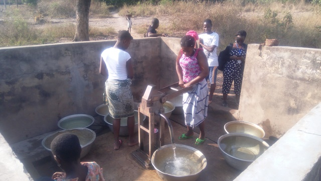
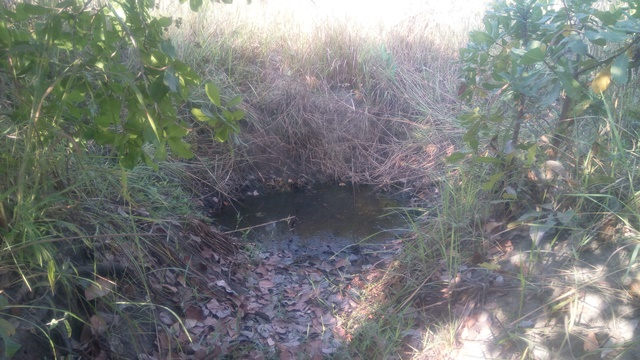

template: article
title: Assengou Kan
slug: assengoukan
iddbb: Assangoukan
tags: Rural
authors: BROU Yves Oscar Kouadio, SORO Doba, MAILLARD Thomas, DIAKITE A. Cheick, KOHE A. Christelle, OUATTARA Mafine, SERI A. Jonathan, N'GUESSAN Firmain Kouakou
date: 2019-01-31
latitude:  7.75783 
longitude: -4.89030
zoom: 16
localisation: Nord-Est de Bouaké, sur la route de Bassawa

|Informations générales||
|:--|--:|
| Nom de la localité : | Assengou Kan (camp) | 
| Population : | 520 habitants | 
| Dessertes en eau potable | Non raccordé au réseau SODECI | 
| Gestion des excrétas | Assainissement autonome | 

## Présentation de la localité
Le village d’Assengoukan est situé à environ 6 kilomètres de Bouaké en sortant du quartier Belleville 2. Il est accessible par une large route en terre battue. Il compte environ 520 habitants et ne dispose ni d’une école primaire ni d'un centre de santé. Les habitants du village se rendent dans la ville de Bouaké notamment à Belleville pour les problèmes de sanitaires. Les élèves du village vont à l’école du village voisin d’Assengoukpli.

On y retrouve essentiellement des habitations de tous types : parpaings, terre, ciment avec des tôles ondulées. On note aussi la présence de cases en banco, mais en de faibles proportions. L'agriculture est l'activité principale : l’igname, le manioc, l’anacarde et les produits maraichers (tomate, piment, aubergine).

En ce qui concerne les infrastructures, le village ne dispose pas de point de collecte d’ordures ménagères. Cette situation oblige la communauté à  déverser les ordures ménagères dans la forêt juste derrière le village. De plus, il faut noter que la majorité des villageois ne disposent pas de toilettes dans leurs maisons et vont faire leur besoin dans la forêt. On observe également des excréments d’animaux partout dans le village et en particulier à proximité des points d’eau.

## Socio anthropologie de la localité 

Le village est peuplé par les Baoulés fahafoués, il appartient au canton Fahafouè-Gossan . Le village est structuré en chefferie: un chef de village  assisté par des notables, un président des jeunes et une présidente des femmes. La chefferie s’occupe de l’organisation générale et du bien-être des habitants du village. En d’autres termes, la chefferie intervient dans le règlement des conflits (intracommunautaire et extracommunautaire). Elle intervient également auprès des collectivités territoriales en faisant des plaidoyers pour l’acquisition de nouvelles infrastructures éducatives, environnementales, hydraulique, etc.

## État des lieux des ouvrages d’alimentation en eau potable

### Ouvrages existants
Le village n’est pas raccordé au réseau de distribution de l'eau géré par la SODECI.

En ce qui concerne l’hydraulique villageoise, le village ne compte qu'une seule pompe à motricité humaine  (PMH) de type ABI  fonctionnelle. Celle-ci date de 1978 et elle tombe souvent en panne : 4 à 5 fois en moyenne dans l’année. La rouille des tuyaux en acier vétuste a un effet sur la qualité de l’eau (goût et couleur) selon les habitants. Le point d’eau est très bien entretenu et l’analyse des paramètres physicochimiques indique seulement une pollution d'origine géologique au fluor, tous les autres paramètres sont conformes aux normes.

 

Les marigots utilisés dans le village en cas de panne de la pompe tarissent en saison sèche et sont très vulnérables aux pollutions et contaminations. Ils sont en outre situés à plus d’un 1 km du village.

### Pratiques et modes d’approvisionnement en eau

Les villageois s'approvisionnent principalement aux pompes, mais se tournent vers les marigots en cas de panne de celles-ci.

### Gestion des points d’eau

Les points d’eau sont gérés par un comité de gestion.Tous les matins, un comité de gestion est chargé d’ouvrir la PMH afin de permettre aux femmes de s’y approvisionner. Afin de réduire les files d'attente, le village est découpé en deux quartiers, chaque quartier ne peut s'approvisionner que 2 jours sur 4. En conséquence, les habitants ont l'habitude de stocker de l'eau chez eux. Le comité organise une file d’attente basée sur l’ordre d’arrivée. Ce processus s’effectue tous les jours de 5 heure du matin jusqu’à 16 heure.Le comité encaisse un prix forfaitaire (10 francs  par cuvette) qui sert à entretenir la pompe et payer les réparations.

## Personnes ressources

* Chef de village 
* Présidente des Femmes                                
* Président des jeunes

## Gestion des excrétas

La gestion des excréta dans le village se fait de manière individuelle. La majeure partie des habitations ne disposent pas de latrines améliorées. Les quelques latrines que l’on rencontre dans le village sont principalement des latrines sèches à fosse simple. Les habitants qui ne disposent pas de latrines pratiquent la défécation à l’air libre. 

Pour ce qui concerne la gestion des ordures ménagères, il n’existe pas un système propre au village. Les déchets ménagers sont collectés et déversés en brousse. 

## Desideratas des populations
| Type d'entretien | Date | 
| :-- | :--: | 
| Entretien individuel Chef de village|31 janvier 2019| 
|| Focus group hommes |31 janvier 2019| 
| Focus group femmes |31 janvier 2019| 

La population d’Assengoukan souhaiterait obtenir de nouvelles PMH, car les PMH existantes sont vétustes et régulièrement en pannes. De plus, ils aimeraient obtenir des latrines et un point de collecte d’ordures.

## Tensions ressenties lors des entretiens

### Tensions générales
Aucune tension signalée

### Tensions autour de l'eau
Du fait de la rareté des points d’eau communautaires, des disputes éclatent dans la file d’attente, toutefois celles-ci demeurent ponctuelles et de faible ampleur.

### Tensions avec les localités voisines
Aucune tension signalée, notamment avec le village voisin de Assengoukpli qui partage ses points d'eau avec Assengoukan en cas de problèmes.
