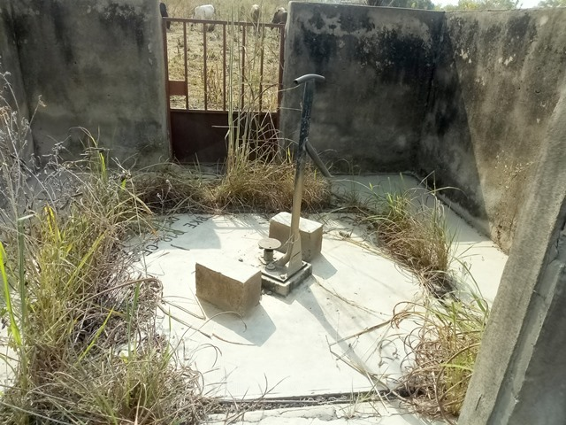
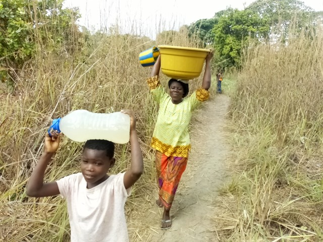

template: article
title: Assengou Kpli
slug: assengoukpli
iddbb: Assangoukpli
tags: Rural
authors: BROU Yves Oscar Kouadio, SORO Doba, MAILLARD Thomas, DIAKITE A. Cheick, KOHE A. Christelle, OUATTARA Mafine, SERI A. Jonathan, N'GUESSAN Firmain Kouakou
date: 2019-01-31
latitude:  7.761065 
longitude: -4.88945
zoom: 16
localisation: Nord-Est de Bouaké, sur la route de Bassawa

|Informations générales||
|:--|--:|
| Nom de la localité : | Assengou Kpli | 
| Population : | 1200 habitants | 
| Dessertes en eau potable | Non raccordé au réseau SODECI | 
| Gestion des excrétas | Assainissement autonome | 

## Présentation de la localité
Le village d’Assengoukpli est limitrophe d’Assengoukan, à environ 7 kilomètres de Bouaké en sortant du quartier Belleville 2. Il est accessible par une large route en terre battue. Il compte environ 1200 habitants et  dispose d’une école primaire, mais d'aucun centre de santé. Les habitants du village se rendent dans la ville de Bouaké notamment à Belleville pour les problèmes de santé.

On y retrouve essentiellement des habitations de tous types : parpaings, terre, ciment avec des tôles ondulées. On note aussi la présence de cases en banco, mais en de faibles proportions. L'agriculture est l'activité principale : l’igname, le manioc, l’anacarde et les produits maraichers (tomate, piment, aubergine).

En ce qui concerne les infrastructures, le village ne dispose pas de point de collecte d’ordures ménagères. Cette situation oblige la communauté à  déverser les ordures ménagères dans la forêt juste derrière le village. De plus, il faut noter que la majorité des villageois ne disposent pas de toilettes dans leurs maisons et vont faire leur besoin dans la forêt. On observe également des excréments d’animaux partout dans le village et en particulier à proximité des points d’eau.

## Socio anthropologie de la localité 

Le village est peuplé par les Baoulés fahafoués, il appartient au canton Fahafouè-Gossan . Le village est structuré en chefferie: un chef de village  assisté par des notables, un président des jeunes et une présidente des femmes. La chefferie s’occupe de l’organisation générale et du bien-être des habitants du village. En d’autres termes, la chefferie intervient dans le règlement des conflits (intracommunautaire et extracommunautaire). Elle intervient également auprès des collectivités territoriales en faisant des plaidoyers pour l’acquisition de nouvelles infrastructures éducatives, environnementales, hydraulique, etc.

## État des lieux des ouvrages d’alimentation en eau potable

### Ouvrages existants
Le village n’est pas raccordé au réseau de distribution de l'eau géré par la SODECI.

En ce qui concerne l’hydraulique villageoise, le village compte 3 pompes à motricité humaine (PMH) dont une seule fonctionnelle de type Vergnet HPV 60. Celle-ci a été construite par la JICA (coopération bilatérale japonaise) en 2015. 
Le point d’eau est très bien entretenu et l’analyse des paramètres physicochimiques indique seulement une forte concentration en fluor d'origine géologique, tous les autres paramètres étant dans les normes.

Les deux autres sont en panne. 

Celle de l’école et monté sur un puits de grand diamètre équipé d’une pompe ABI datant de 1978. Le puits contient de l’eau et les buses sont en bon état. Seule la pompe est abîmée.

La deuxième pompe en panne est installée sur un forage. La pompe est de type Vergnet HPV 60 construite en 1998. Elle desservait la partie basse du village. Le cylindre de commande de PMH ne fonctionne plus.

Le marigot  du village tarit en saison sèche. Il très vulnérable à la pollution.

### Pratiques et modes d’approvisionnement en eau

Les villageois s'approvisionnent à la pompe pour tous leurs besoins en eau de boisson et pour les tâches ménagères. Le marigot est peu utilisé, car il est très loin des habitations. Toutefois, il constitue une solution de repli en cas de panne de la pompe.

### Gestion des points d’eau

La pompe est gérée par une femme du village qui est chargé d'ouvrir le matin et de fermer le soir. Elle désigne chaque jour une famille différente qui a la charge de la gestion de la file d'attente et du recueil du prix de l'eau (10 francs par cuvette). L'argent recueilli alimente la caisse d'eau qui permet de financer les réparations de la pompe.

## Personnes ressources

* Chef de village 
* Présidente des Femmes                                
* Président des jeunes

## Gestion des excrétas
La gestion des excréta dans le village se fait de manière individuelle. La majeure partie des habitations ne disposent pas de latrines améliorées. Les quelques latrines que l’on rencontre dans le village sont principalement des latrines sèches à fosse simple. Les habitants qui ne disposent pas de latrines pratiquent la défécation à l’air libre. 

Pour ce qui concerne la gestion des ordures ménagères, il n’existe pas un système propre au village. Les déchets ménagers sont collectés et déversés en brousse. 

## Desideratas des populations
| Type d'entretien | Date | 
| :-- | :--: | 
| Entretien individuel Chef de village |31 janvier 2019| 
| Entretien individuel Président des Femmes|31 janvier 2019| 
| Entretien individuel Présidente du comité de gestion|31 janvier 2019| 
| Focus group hommes |31 janvier 2019| 
| Focus group femmes |31 janvier 2019| 

Le souhait commun des habitants est de réhabiliter les PMH en panne, et d'en construire au moins 1 en plus.

## Tensions ressenties lors des entretiens

### Tensions générales
Aucune tension signalée

### Tensions autour de l'eau
Du fait de la rareté des points d’eau communautaires, des disputes éclatent dans la file d’attente, toutefois celles-ci demeurent ponctuelles et de faible ampleur.

### Tensions avec les localités voisines
Aucune tension signalée, notamment avec le village voisin de Assengoukan qui partage ses points d'eau avec Assengoukpli en cas de problèmes.

