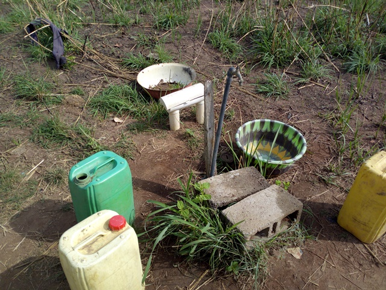

template: article
title: Assiêblénou
slug: assieblenou
iddbb: Assieblenou
tags: Rural
authors: BROU Yves Oscar Kouadio, SORO Doba, MAILLARD Thomas, DIAKITE A. Cheick, KOHE A. Christelle, OUATTARA Mafine, SERI A. Jonathan, N'GUESSAN Firmain Kouakou
date: 2019-02-19
latitude:  7.69440 
longitude: -5.19193
zoom: 16
localisation: Ouest de Bouaké

|Informations générales||
|:--|--:|
| Nom de la localité : | Assiêblénou | 
| Population : | 1000 habitants | 
| Dessertes en eau potable | Raccordé au réseau SODECI | 
| Gestion des excrétas | Assainissement autonome |
 

## Présentation de la localité
Assièblénou est un village de la Sous-préfecture de Bouaké situé à 10 km dans la direction sur l’axe Bouaké-Béoumi. Il compte plus de 1000 habitants. Assièblénou abrite une école primaire, mais pas de centre de santé. Le village est relié au réseau de la SODECI. Cependant il n’y a pas d’électricité dans le village.

En ce qui concerne la typologie d’habitat que l’on retrouve dans ce village, elle est plutôt sous un style traditionnel avec des maisons construites en banco. On trouve aussi des maisons modernes. La majorité des habitations est dépourvues de latrines et les habitants pratiquent la défécation à l'air libre en lisière du village.

Les activités génératrices de revenus sont généralement axées sur l’agriculture avec une production d’anacarde comme culture de rente et le riz, l’igname, etc. comme cultures vivrières

## État des lieux des ouvrages d’alimentation en eau potable

### Ouvrages existants
Le village est raccordé au réseau de la SODECI.

En complément, le village compte un forage équipé de PMH. Le forage est assez récent et date de septembre 2018. Il a été offert par le conseil régional de Bouaké. Depuis lors, on ne note pas de pannes sur la pompe. Toutefois, notons que la pompe est éloignée du village. Elle est située de l’autre côté de la grande route hors du village, ce qui peut selon les leaders communautaires du village, être dangereux pour les enfants qui doivent traverser la route pour aller puiser de l’eau. L’eau est gratuite. Mais la pompe est très peu fréquentée à cause de la distance. Les populations préfèrent se rabattre sur l’eau du robinet. Seuls ceux qui ne disposent pas d’eau courante sont obligés de parcourir cette distance pour se procurer de l’eau à la pompe.
L’enquête sanitaire réalisée au niveau du forage indique que ce point d’eau ne présente pas de risque pour la santé des populations. Les analyses de la qualité de l’eau révèlent l’absence d’une pollution azotée dans les échantillons d’eau. Les paramètres microbiologiques ont révélé la présence de *E. coli* dans l’eau du forage (24 UFC/100mL).

### Gestion des points d’eau

 Il n’existe pas de comité de gestion de la pompe.

## Personnes ressources

* Chef de village

## Gestion des excrétas
L’évacuation des selles dans le village se fait à partir de différents types de latrines. Nous avons des latrines à fosses septiques avec ou sans chasse d’eau et des latrines à fosse directe. Néanmoins, comme dans plusieurs villages, la défécation en brousse se fait toujours.
## Desideratas des populations
| Type d'entretien | Date | 
| :-- | :--: | 
| Entretien individuel Chef de village |19 Fevrier 2019| 
| Entretien individuel Président des Femmes|19 Fevrier 2019| 
| Entretien individuel Présidente du comité de gestion|19 Fevrier 2019| 
| Focus group hommes |19 Fevrier 2019| 
| Focus group femmes |19 Fevrier 2019| 

Les habitants souhaiteraient avoir une nouvelle pompe à proximité des habitations.

## Tensions ressenties lors des entretiens

### Tensions générales
Aucune tension signalée

### Tensions autour de l'eau
Du fait de la rareté des points d’eau communautaires, des disputes éclatent dans la file d’attente, toutefois celles-ci demeurent ponctuelles et de faible ampleur.

### Tensions avec les localités voisines
Aucune tension signalée.

