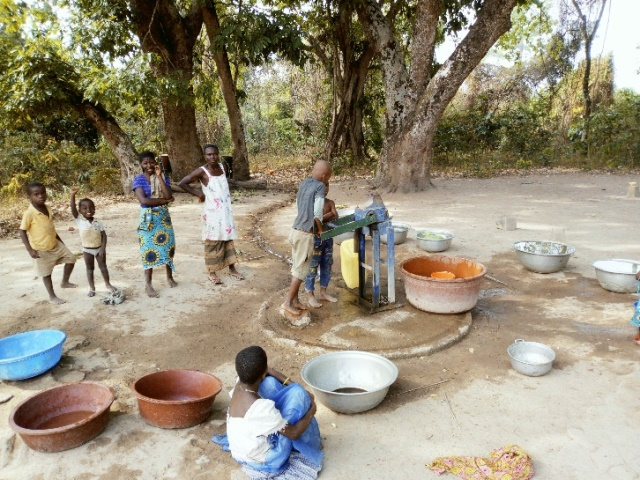

template: article
title: Blétromanbo
slug: bletromanbo
iddbb: Bletromanbo
tags: Rural
authors: BROU Yves Oscar Kouadio, SORO Doba, MAILLARD Thomas, DIAKITE A. Cheick, KOHE A. Christelle, OUATTARA Mafine, SERI A. Jonathan, N'GUESSAN Firmain Kouakou
date: 2019-02-14
latitude:  7.65178
longitude: -5.16917 
zoom: 16
localisation: Ouest de Bouaké, entre la route de Béoumi et la route de Sakassou

|Informations générales||
|:--|--:|
| Nom de la localité : | Blétromanbo | 
| Population : | 400 habitants | 
| Dessertes en eau potable | Non raccordé au réseau SODECI | 
| Gestion des excrétas | Assainissement autonome |

## Présentation de la localité
Le village de Blétromanbo est situé à l’ouest de la ville de Bouaké sur le tronçon Bouaké-Béoumi. Il est accessible par une route carrossable en terre battue à partir de Sessenouan ou de Totokro. C’est un petit village d’environ 400 habitants. Le village dispose d’une grande école primaire et d’un centre de santé. Toutefois, il n'est raccordé ni à l'électricité ni à l'eau courante.

L’habitat du village est composé essentiellement de maisons faites en briques de terre battue couverte de pailles ou de tôles. Néanmoins on peut observer quelques maisons faites en briques de ciment. Les habitations ne sont pas équipées de latrines et les habitants pratiquent la défécation à l'air libre en lisière du village.

À Blétromanbo, les activités agricoles sont toujours d’actualité avec essentiellement la culture de l’anacarde et les cultures vivrières telles que l’igname, le manioc et les produits maraichers (tomate, piment, aubergine).

## État des lieux des ouvrages d’alimentation en eau potable

### Ouvrages existants
Le village de Blètromanbo n’est pas raccordé au réseau de la SODECI.

En termes d’hydraulique villageoise, il dispose d’un forage équipé d’une pompe à motricité humaine. La pompe du village date des années 1980 et est toujours fonctionnelle. Elle a été offerte par l’État au village. La superstructure du point d’eau manque cependant certains éléments, mais il y a de l’eau toute l’année. La pompe tombe en panne en moyenne 4 fois dans l’année. Cela s’explique par le faite qu’elle est beaucoup sollicitée comme seule source d’eau potable dans le village. L’accès au point d’eau est public, mais l’eau est vendue au prix de 10 francs la cuvette.
L’inspection sanitaire réalisée autour du point d’eau a montré une faible vulnérabilité du point d’eau, mais l’eau était contaminée par *E. coli*.

Un marigot est situé à 100 m du village, mais ce dernier tarit en saison sèche. Lors de notre passage dans le village le marigot avait presque tari. La population s'y approvisionne en cas de panne de la pompe ou bien se rend dans les villages avoisinants.

### Gestion des points d’eau

La PMH est gérée par le président des jeunes du village qui désigne à tour de rôle une famille du village chargé d'entretenir la pompe et de recueillir le prix de l'eau. Il n'y a pas de comité de gestion et de caisse spécifique pour cette pompe.

## Personnes ressources 

* Le chef du village
* Le président des jeunes
* Les membres du comité d’organisation

## Gestion des excrétas
L’évacuation des selles dans le village se fait à partir de différents types de latrines. Nous avons des latrines à fosses septiques avec ou sans chasse d’eau et des latrines à fosse directe. Néanmoins, comme dans plusieurs villages, la défécation en brousse se fait toujours.

## Desideratas des populations
| Type d'entretien | Date | 
| :-- | :--: | 
| Entretien individuel Chef de village |15 février 2019| 
| Entretien individuel Président des Femmes|15 février 2019|
| Entretien individuel Présidente du comité de gestion|15 février 2019|  
| Focus group hommes |15 février 2019| 
| Focus group femmes |15 février 2019|

1. La réparation des pompes en panne,
2. la construction d'une nouvelle pompe,
3. la formation des membres d'un comité de gestion des pompes,
4. la construction de latrine et la mise en place d'un point de collecte des ordures.

## Tensions ressenties lors des entretiens

### Tensions générales
Aucune tension signalée

### Tensions autour de l'eau
Du fait de la rareté des points d’eau communautaires, des disputes éclatent dans la file d’attente, toutefois celles-ci demeurent ponctuelles et de faible ampleur.

### Tensions avec les localités voisines
Aucune tension signalée.
