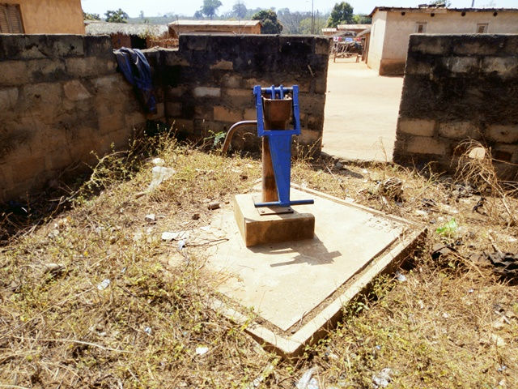

template: article
title: Konankro Mizron
iddbb: Konankro
slug: konankro
tags: Rural
authors: BROU Yves Oscar Kouadio, SORO Doba, MAILLARD Thomas, DIAKITE A. Cheick, KOHE A. Christelle, OUATTARA Mafine, SERI A. Jonathan, N'GUESSAN Firmain Kouakou
date: 2019-05-10
latitude: 7.83244
longitude: -5.08203
zoom: 16
localisation: Nord de Bouaké

|Informations générales||
|:--|--:|
| Nom de la localité : | Konankro | 
| Population : | 2000 habitants | 
| Dessertes en eau potable | Non raccordé au réseau SODECI | 
| Gestion des excrétas | Assainissement autonome | 

## Présentation de la localité
Konankro est un village d’environ 2000 habitants situés à environ 12 km de Bouaké et accessibles par une large route en terre battue qu dessert Bamoro Gare.  En ce qui concerne les infrastructures, le village dispose d’une école dont il partage avec le village voisin Kouakro Mizron, ne dispose d’aucun dispensaire et d’aucun point de collecte d’ordures ménagères. Cette situation oblige la communauté à déverser les ordures ménagères dans un lieu public. De plus, il faut noter que la majorité des villageois ne disposent pas de toilettes dans leurs maisons. En effet, les anciennes constructions (cases) ne prévoyaient pas de toilettes, du coup, les villageois vont faire leur besoin dans la forêt. On observe également des excréments d’animaux partout dans le village et également à proximité des points d’eau. Konankro est relié au réseau électrique. Cependant, celui de la SODECI n’est pas encore disponible pour le village. 

 
La typologie d’habitat que l’on retrouve dans ce village s’apparente à un style traditionnel. Les maisons construites en géo béton ou en banco. Les activités génératrices de revenus sont généralement axées sur l’agriculture avec une production d’anacarde comme culture de rente et le riz, l’igname, etc. comme cultures vivrières. 

## Socio-Anthropologie

Le village est peuplé des Baoulés fahafouè ou pharis et appartient au canton de Konankankro.

## État des lieux des ouvrages d’alimentation en eau potable
### Existants
Le village compte 5 points d’eau, dont un forage à énergie solaire installé en 2018 et 4 forages équipés de PMH. Parmi ces points d’eau, seulement 3 sont fonctionnels (la pompe de l’école, celle de l’Église catholique et le forage solaire). La pompe solaire alimente un château d'eau.
Les autres ont des pannes qui se situent au niveau des tuyaux et certaines pièces manquantes. L'une des pompes a été démontée pour fournir des pièces de rechange.
Les analyses des paramètres physiques de l’eau de la pompe ont démontré que l’eau avait une forte concentration en nitrate (52,8 mg/l ; 66 mg/l) et en fluor (1,4 mg/l et 1,5 mg/l). On note aussi la présence de colonies de *E col*i comme le témoigne l’analyse microbiologique (107 et 123 UFC/100ml). Ces points d’eau ont un niveau de vulnérabilité très élevé.

### Pratiques et modes d’approvisionnement en eau

La population de Konankro Mizron s'approvisionne majoritairement au château d’eau raccordé aux maisons, aux forages et marigots. Les pannes récurrentes du forage, les coupures de l’eau du château, les incitent à privilégier l’eau du marigot.  Il faut souligner qu’il existe 2 PMH dans le village dont une fonctionnelle. Mais il apparait que le processus d’approvisionnement est lent et certains points d’eau sont éloignés des ménages en particulier les marigots.
 

### Mode de gestion

La gestion des pompes et du forage revient au responsable du comité de gestion, l'entretien et le recouvrement du tarif (10 FCFA par bassine) se font tour à tour selon la personne choisie par le comité.

 Les marigots sont très utilisés par les femmes à cause des pannes récurrentes de la pompe et les coupures d’eau du château. Mais il existe des interdits autour de ces marigots. En effet, les mercredi et vendredi les femmes sont interdites d’y aller sous peine de sanction.

## Personnes ressources
 
* Le représentant du chef
* le président des jeunes
* La présidente des femmes

## Gestion des excréta
Konankro est assez vulnérable au niveau de l’hygiène et de l’assainissement. La majeure partie des concessions ne dispose pas de latrine. Par conséquent, la défécation à l’air libre continue de se faire par les habitants du village. Pour ce qui concerne la gestion des ordures ménagères, il n’existe pas un système propre au village. Les déchets ménagers sont collectés et déversés en brousse. 

## Desideratas des populations

| Type d'entretien | Date | 
| :-- | :--: | 
| Entretien individuel Chef de village|07 Fevrier 2019| 
|| Focus group hommes |07 Fevrier 2019| 
| Focus group femmes |07 Fevrier 2019|

La population de Konankro Mizron souhaiterait qu’on améliore la distribution de l’eau du château pour qu’il n’y ait plus de coupures puis réhabiliter leur pompe en panne. Enfin, entretenir les marigots, former et renforcer la capacité des membres des comités de gestion. De plus, ils aimeraient obtenir des toilettes et un point de collecte d’ordures.

## Tensions ressenties lors des entretiens

### Tensions générales
Aucune tension signalée

### Tensions autour de l'eau
Du fait de la rareté des points d’eau communautaires, des disputes éclatent dans la file d’attente, toutefois celles-ci demeurent ponctuelles et de faible ampleur.

### Tensions avec les localités voisines
Aucune tension signalée.

