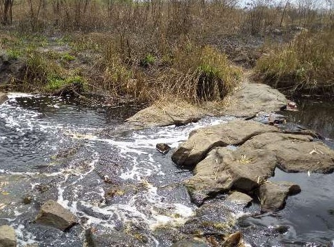
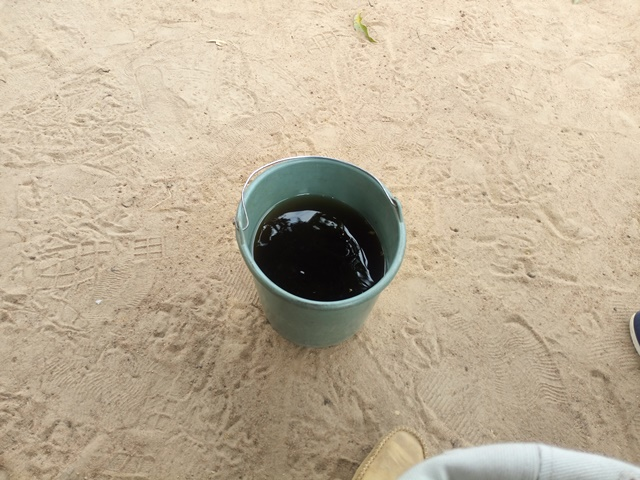

template: article
title: Kouassiblékro N’Gbassou
slug: kouassiblekro-ngbassou
iddbb: Kouassiblekro N’gbassou
tags: Rural
authors: BROU Yves Oscar Kouadio, SORO Doba, MAILLARD Thomas, DIAKITE A. Cheick, KOHE A. Christelle, OUATTARA Mafine, SERI A. Jonathan, N'GUESSAN Firmain Kouakou
date: 2019-01-18
latitude: 7.79296
longitude: -4.99105
zoom: 16
localisation: Nord de Bouaké

|Informations générales||
|:--|--:|
| Nom de la localité : | Kouassiblékro N’Gbassou | 
| Population : | 100 habitants | 
| Dessertes en eau potable | Pas raccordé au réseau SODECI | 
| Gestion des excrétas | Assainissement autonome | 

## Présentation de la localité

Situé à la sortie nord de la commune de Bouaké, le village de Kouassiblékro N’Gbassou se trouve à environ 3 kilomètres du village de Golikro et à 7 kilomètres de la ville de Bouaké. **Attention, il ne faut pas confondre ce village avec un célèbre village homonyme (chef-lieu de canton) situé sur l'axe de Brobo, moins de 10 kilomètres à l'ouest de Bouaké**.  Il appartient au canton de Konankankro et n'est accessible que par une piste étroite (permettant le passage d'une moto seulement) à partir du village de Golikro. Il abrite une centaine d'habitants.

Ne disposant d'aucun équipement communautaire de base (ni école, ni centre de santé, ni hydraulique villageoise améliorée), les villageois dépendent des équipements de Golikro.

On y retrouve essentiellement des habitations de tous types : des habitations en parpaings, en terre ou en ciment avec des tôles ondulées. 

Il n'y a pas de système de gestion des ordures ménagères, aussi celles-ci sont déposées en marge du village à la lisère de la forêt. Les habitations ne sont pas équipées de latrines, aussi les habitants pratiquent la défécation à l'air libre à l'écart des habitations.

L'activité principale du village est l'agriculture vivrière (igname, manioc, riz et autres productions maraîchères tomates, piments et aubergines) et la culture de rente de l'anacarde. Les femmes du village transforment le manioc en attiéké dans de petites unités de production familiales. Chaque ménage élève quelques moutons ou quelques chèvres. Durant la saison des pluies, les animaux sont gardés dans des enclos pour qu'ils ne divaguent pas dans les espaces cultivés.

## Socio anthropologie de la localité 

Kouassiblékro N’Gbassou est un village habité par les Baoulés Fahafouè.  L'organisation sociale du village est similaire à l'organisation classique des communautés villageoises Baoulé. Les affaires du village sont gérées par les notables formant une chefferie hiérarchisée qui intègre aussi des représentants des organisations de femmes et de jeunes. La chefferie intervient dans le règlement des conflits (intracommunautaires et extracommunautaires) et joue un rôle d'interface entre la communauté villageoise et les administrations publiques et collectivités territoriales.

Ce village est particulièrement enclavé et isolé, en conséquence il présente un retard important en matière d'équipement. Cette situation expliquerait la faible population du village.

Ce village est associé à un mythe fondateur de la ville de Bouaké pour les Baoulés, il présente donc une grande importance symbolique et religieuse. Lors de la création de Kouassiblékro N'Gbassou, le village aurait subit une action mystique interdisant à sa population de croître. En conséquence, certains de ses habitants seraient partis fonder un autre village du même nom à l'ouest de l'actuel Bouaké. Ce nouveau village serait à l'origine de la création de la ville de Bouaké. Ce mythe tend à faire de Kouassiblékro N'Gbassou un sanctuaire animiste Baoulé habité par une petite communauté respectée et protégée des influences extérieures. Aujourd'hui, la perte d'influence de la religion traditionnelle Baoulé et la précarité de la qualité de vie pousse les ressortissants du village à s'installer ailleurs. Les notables locaux s'investissent dans des projets visant à construire des équipements dans le village et à rompre son isolement. 

## État des lieux des ouvrages d’alimentation en eau potable

### Ouvrages existants

Le village de Kouassiblékro N’Gbassou ne dispose d’aucune source d’eau sure notamment d’hydraulique villageoise et de puits. Les habitants du village s’approvisionnent dans les marigots et la rivière aux alentours du village. Toutes les tentatives pour la construction de puits à grand diamètre se sont soldées par des échecs ou des points d’eau qui tarissent précocement en saison sèche.

L’enquête sanitaire réalisée sur les s d’approvisionnement du village révèle une grande vulnérabilité de celles-ci. Les analyses de la qualité de l’eau ont indiqué une forte contamination de ces sources en *E. coli* et des teneurs en fluor très importantes, quasiment à la limite du seuil tolérable pour les eaux de boisson. 

### Pratiques et modes d’approvisionnement en eau
L’eau de la rivière est utilisée exclusivement pour les tâches ménagères (lessives, toilette du corps). Les marigots sont utilisés pour la cuisine et la boisson. 

### Gestion des points d’eau
Le village n’a aucun point d’approvisionnement en eau potable. Le marigot est accessible à tous. Les hommes descendent souvent pour nettoyer les alentours pour tenter de garantir la propreté de l’environnement des marigots. Ces marigots produisent de l’eau en saison pluvieuse. En saison sèche, lorsque les marigots s’assèchent, les communautés se rabattent sur les pompes de Golikro à environ 3 kilomètres. Ils s'y rendent en moto, pour remplir des jerricans de 20 litres lorsqu'ils ont les moyens de payer le carburant.

Certains notables ont évoqué des règles d'usages relatives à l'utilisation de l'eau des marigots. Les femmes n'auraient pas le droit d'utiliser l'eau des marigots les mercredi et vendredi. Comme ce sont les femmes qui puisent l'eau pour la famille, cette règle permettait à la réserve d'eau des marigots de se reconstituer. Toutefois, avec la raréfaction de la ressource, cette règle est moins respectée.

## Personnes ressources

* Chef de village de village de Kouassiblékro N’Gbassou
* Président des jeunes de Kouassiblékro N’Gbassou

## Assainissement et gestion des excrétas

La gestion des ordures ménagères se fait de manière individuelle dans les habitations. Généralement dans les villages, un site est identifié et utilisé comme dépotoir des ordures ménagères.
Quant à la gestion des excréta dans le village, on retrouve essentiellement les latrines sèches à fosse simple. Certaines habitations ne disposent pas de latrines, la majorité des habitants pratique donc la défécation à l’air libre.

##Desideratas des populations
| Type d'entretien | Date | 
| :-- | :--: | 
| Entretien individuel Chef de village Kouassiblékro N’Gbassou |18 janvier 2019| 
| Entretien individuel Président des jeunes Kouassiblékro N’Gbassou |18 janvier 2019|
| Focus group femmes Kouassiblékro N’Gbassou |18 janvier 2019|

Le manque d'eau potable est un problème majeur dans ce village, comme en témoignent les tentatives avortées de création de puits. Les villageois souhaiteraient être équipés d'un point d'eau avec une pompe à motricité humaine.

## Tensions ressenties lors des entretiens

### Tensions générales
Aucune tension constatée. 

### Tensions autour de l'eau
Les tensions sont aussi rares que l’eau à Kouassiblékro N’Gbassou. 

### Tensions avec les localités voisines
Selon les témoignages, il n’existe pas de tension entre ce village et les autres. 

