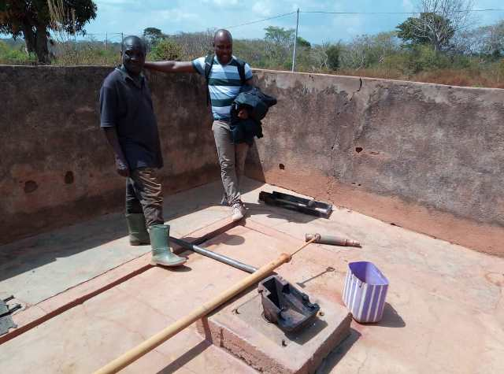

template: article
title: Langbassou
slug: langbassou
iddbb: Langbassou
tags: Rural
authors: BROU Yves Oscar Kouadio, SORO Doba, MAILLARD Thomas, DIAKITE A. Cheick, KOHE A. Christelle, OUATTARA Mafine, SERI A. Jonathan, N'GUESSAN Firmain Kouakou
date: 2019-01-30
latitude:  7.79763
longitude: -4.86609
zoom: 16
localisation: Nord-Est de Bouaké, sur la route de Bassawa

|Informations générales||
|:--|--:|
| Nom de la localité : | Langbassou | 
| Population : | 1500 habitants | 
| Dessertes en eau potable | Non raccordé au réseau SODECI | 
| Gestion des excrétas | Assainissement autonome |

## Présentation de la localité
Le village de Langbassou est situé à environ 13 kilomètres de Bouakéau bord de la route nationale 10 qui dessert Bassawa. Il compte environ 1500 habitants et  dispose d’une école primaire et d’un centre de santé.

On y retrouve essentiellement des habitations de tous types : parpaings, terre, ciment avec des tôles ondulées. On note aussi la présence de cases en banco, mais en de faibles proportions. L'agriculture est l'activité principale : l’igname, le manioc, l’anacarde et les produits maraichers (tomate, piment, aubergine).

En ce qui concerne les infrastructures, le village ne dispose pas de point de collecte d’ordures ménagères. Cette situation oblige la communauté à  déverser les ordures ménagères dans la forêt juste derrière le village. De plus, il faut noter que la majorité des villageois ne disposent pas de toilettes dans leurs maisons et vont faire leur besoin dans la forêt. On observe également des excréments d’animaux partout dans le village et en particulier à proximité des points d’eau.

## Socio anthropologie de la localité 

Situé à l’Est de la ville de Bouaké, Affouékro est un village habité par les Baoulés fahafouè, sous-groupe du peuple Akan. Le village est régi par une autorité traditionnelle composée d’un chef de village, de plusieurs notables, de deux présidents de jeunesse (homme et femme). Le chef  du village est l’autorité exécutive en charge de la prise de décision dans le village. Celui-ci est accompagné par les notables qui font office de conseillers. Quant aux présidents de jeunesses, ceux-ci sont responsables de l’intégration communautaire des membres à travers des activités festives et ludiques. Ils interviennent aussi dans la médiation des conflits communautaires.

## État des lieux des ouvrages d’alimentation en eau potable

### Ouvrages existants
Le village n’est raccordé pas au réseau de la SODECI.

Ponctuellement, lors de grave pénurie, le village reçoit une alimentation d'urgence par camion-citerne.

En ce qui concerne l’hydraulique villageoise, Langbassou dispose d’un seul forage qui était en cours de réparation lors de notre enquête, la pompe ABI de 1978 tombe très souvent en panne et les pièces sont vétustes. Le village a un autre forage construit entre l’école et le dispensaire et réservé exclusivement à ces 2 structures.

L’eau du réservoir de barrage situé à environ 2 km est utilisée par les activités domestiques.

Le seul point d’eau étant en panne, aucun prélèvement n’a pu être effectué.

### Pratiques et modes d’approvisionnement en eau

L’eau du forage sert à tous les usages dans le village. 

L’eau du réservoir de barrage est plutôt utilisée en cas de longue panne de la pompe, cependant elle n'est pas utilisée pour la boisson. Toutefois, lorsque la file d'attente est trop longue à la pompe certains habitants préfèrent s'approvisionner au réservoir du barrage.

### Gestion des points d’eau

Il n'y a pas de comité de gestion de la pompe. Une personne est chargée de surveiller et d'encaisser les cotisations en prévision des réparations.

## Personnes ressources

* Chef de village 
* Présidente des Femmes                                
* Président des jeunes

## Gestion des excrétas

Lamgbassou ne dispose pas d’un réseau de drainage des eaux de pluie et usées. Ces eaux sont généralement déversées dans les cours des maisons ou dans les broussailles environnantes. Le niveau d’assainissement est faible, car on observe des excréments d’humains et d’animaux aux abords du village. On y observe également des déchets ménagers à savoir des sachets plastiques, des bouts de papier et des noyaux de fruits (mangues) partout dans le village. Nos entretiens ont révélé que la majorité des habitants n’ont pas de toilettes, raison pour laquelle on retrouve des excréments aux abords du village. Ainsi, le manque d’infrastructures d’assainissement contribue au fait que les habitants défèquent à l’air libre. Enfin, les animaux n’ayant pas d’enclos se promènent et défèquent partout dans le village.

## Desideratas des populations
| Type d'entretien | Date | 
| :-- | :--: | 
| Entretien individuel Chef de village |01 Fevrier 2019| 
| Entretien individuel Président des Femmes|01 Fevrier 2019| 
| Focus group hommes|01 Fevrier 2019| 
| Focus group femmes|01 Fevrier 2019| 

Les habitants souhaiteraient que leur forage soit réhabilité et qu'un nouveau forage équipé d'une pompe soit construit dans le village.

## Tensions ressenties lors des entretiens

### Tensions générales
Aucune tension signalée

### Tensions autour de l'eau
Du fait de la rareté des points d’eau communautaires, des disputes éclatent dans la file d’attente, toutefois celles-ci demeurent ponctuelles et de faible ampleur.

### Tensions avec les localités voisines
Aucune tension signalée.

