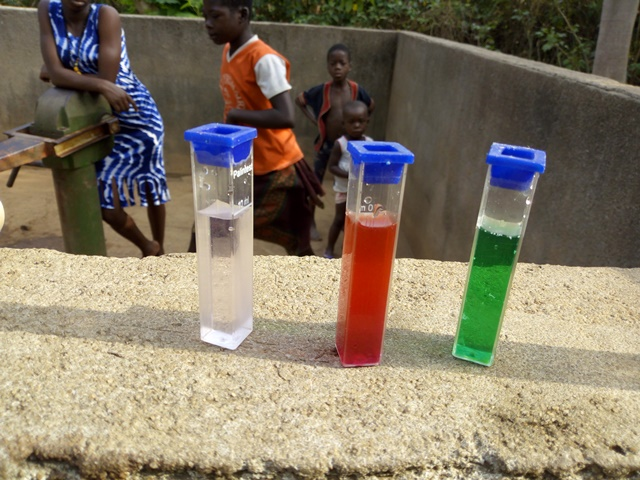
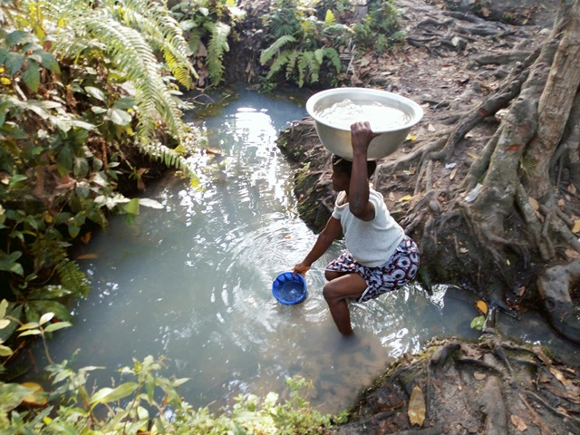

template: article
title: Sessenouan
slug: sessenouan
iddbb:  Sessenouan
tags: Rural
authors: BROU Yves Oscar Kouadio, SORO Doba, MAILLARD Thomas, DIAKITE A. Cheick, KOHE A. Christelle, OUATTARA Mafine, SERI A. Jonathan, N'GUESSAN Firmain Kouakou
date: 2019-02-19
latitude:  7.69015 
longitude: -5.14573
zoom: 16
localisation: Ouest de Bouaké, sur la route de Béoumi

|Informations générales||
|:--|--:|
| Nom de la localité : | Sessenouan | 
| Population : | 650 habitants | 
| Dessertes en eau potable | Raccordé au réseau SODECI | 
| Gestion des excrétas | Assainissement autonome |

## Présentation de la localité
Situé à 5km à l’ouest de la ville de Bouaké sur l’axe Bouaké-Béoumi, Sessenouan est un village peuplé majoritairement par les Baoulés. Au total, ce sont environ plus de 650 habitants qui peuplent ce village. Ce village est subdivisé en 3 sous-quartiers, dont Bonikro, Kouassi Houssou et Kouamékro. Sessenouan abrite une école primaire, mais aucun centre de santé. Le village est raccordé au réseau électrique et au réseau de la SODECI.

La typologie d’habitat que l’on retrouve dans ce village s’apparente à un style plutôt moderne certainement dû à la proximité de la ville. Les maisons construites en dur pour la plupart avec des matériaux modernes. Cependant on ne manque pas d’observer quelques constructions traditionnelles (habitats en banco coiffés de pailles et papos). Les concessions modernes appartiennent pour la plupart à des cadres du village travaillants en ville et autres retraités. Seules les habitations les plus récentes disposent de latrines, et les habitants pratiquent la défécation à l'air libre en lisière du village.

Les activités génératrices de revenus sont généralement axées sur l’agriculture avec une production d’anacarde comme culture de rente et le riz, l’igname, etc. comme cultures vivrières. On observe aussi certains investissements dans le commerce et la gastronomie.

## État des lieux des ouvrages d’alimentation en eau potable

### Ouvrages existants
Le village est raccordé au réseau de la SODECI. Il dispose aussi d'une fontaine publique raccordée au réseau de la SODECI, mais celle-ci est endommagée.

Le village compte un équipement d'hydraulique villageoise amélioré: un forage équipé de PMH. Le forage date de 1980, mais a été abandonné pendant la crise de 2002 suite à des pannes. Cependant, il a récemment été réhabilité en 2018 par l’ambassade du Canada suite à la crise de l’eau survenue dans la zone. Depuis lors, on ne note pas de pannes sur la pompe. Toutefois, notons que la pompe est installée près du cimetière du village. Selon les leaders communautaires du village, la pompe a été installée bien avant le cimetière. Les analyses des paramètres physiques de l’eau de la pompe ont démontré que l’eau avait un pH acide (5.06). Quant aux paramètres chimiques, ils ont démontré une forte concentration en ammoniac (1 mg/l) et en nitrate (66 mg/l). Ces éléments pourraient justifier le goût de l’eau jugée salée selon les populations du village.

 

    
	 
	  
	   

Les habitants s'approvisionnent aussi dans 3 marigots. Les usages de l’eau des marigots varient selon la qualité de la source. Les enquêtes ont porté sur 2 marigots dont l’un sert d’eau de boisson tandis que l’autre est utilisé pour la lessive et le bain.

  

### Gestion des points d’eau

Le village ne dispose d'aucun comité de gestion spécifique pour les pompes. La gestion revient à une seule personne, choisie par le chef ou selon sa proximité d’avec le point d’eau.  Cette personne s’assure du bon fonctionnement de la pompe et de la collecte de l’argent, la vente. L’eau de la pompe est vendue à 25 francs par cuvette. Cependant, les marigots sont le plus utilisés par les femmes à cause des pannes récurrentes de la pompe et du goût désagréable de l'eau qu'elle fournit.

##  Personnes ressources

* Chef de village

##  Gestion des excrétas
L’évacuation des selles dans le village se fait à partir de différents types de latrines. Nous avons des latrines à fosses septiques avec ou sans chasse d’eau et des latrines à fosse directe. Néanmoins, comme dans plusieurs villages, la défécation en brousse se fait toujours.
##  Desideratas des populations
| Type d'entretien | Date | 
| :-- | :--: | 
| Entretien individuel Chef de village |19 Février 2019| 
| Entretien individuel Président des Femmes|19 Février 2019| 
| Entretien individuel Présidente du comité de gestion|19 Février 2019| 
| Focus group hommes |19 Février 2019| 
| Focus group femmes |19 Février 2019| 

1. La réparation des pompes en panne,
2. la construction d'une nouvelle pompe,
3. la formation des membres d'un comité de gestion des pompes,
4. la construction de latrine et la mise en place d'un point de collecte des ordures.

## Tensions ressenties lors des entretiens

### Tensions générales
Aucune tension signalée

### Tensions autour de l'eau
Du fait de la rareté des points d’eau communautaires, des disputes éclatent dans la file d’attente, toutefois celles-ci demeurent ponctuelles et de faible ampleur.

### Tensions avec les localités voisines
Aucune tension signalée.

