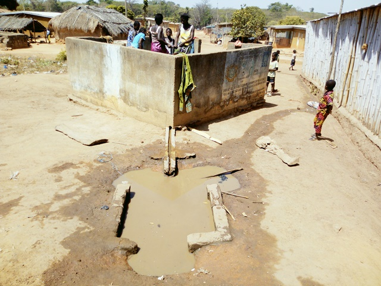

template: article
title: Tchimou-Assêkro
slug: tchimouassekro
iddbb: Tchimou-Assêkro
tags: Rural
authors: BROU Yves Oscar Kouadio, SORO Doba, MAILLARD Thomas, DIAKITE A. Cheick, KOHE A. Christelle, OUATTARA Mafine, SERI A. Jonathan, N'GUESSAN Firmain Kouakou
date: 2019-02-12
latitude:  7.84072 
longitude: -5.06314 
zoom: 16
localisation: Nord de Bouaké

|Informations générales||
|:--|--:|
| Nom de la localité : | Tchimou-Assêkro | 
| Population : | 1500 habitants | 
| Dessertes en eau potable | Non raccordé au réseau SODECI | 
| Gestion des excrétas | Assainissement autonome | 

## Présentation de la localité
Tchimou-Assêkro est un village de la Sous-préfecture de Bouaké situé au nord-ouest de la ville. Ce village abrite une école primaire, mais pas de centre de santé local. Le village est relié au réseau électrique. Celui de la SODECI n’est pas encore disponible dans le village. On dénombre au total, près de 1500 habitants composés d’autochtones Baoulé et d’allogènes Peuls, Burkinabé, etc. Les autochtones Baoulé de ce village font partie du sous-groupe pharis.
Le type d’habitat que l’on retrouve à Tchimou-Assêkro est de style traditionnel villageois avec des maisons construites en banco. Toutefois l’on ne manque pas de rencontrer certains habitats de type moderne faite de brique en ciment et couverte de tôle ondulée.
Les activités génératrices de revenus sont généralement axées sur l’agriculture avec une production d’anacarde comme culture de rente et le riz et l’igname comme cultures vivrières

## Socio anthropologie de la localité 

Tchimou-assèkro est un village habité par les Baoulés phari. À Tchimou-assèkro, il y a un chef de village, des notables, un président des jeunes et une présidente des femmes. Par ailleurs, le village appartient au canton de Konankankro. 

## Etat des lieux des ouvrages d’alimentation en eau potable

### Existants
Le village compte 2 points d’eau : des forages équipés de PMH. Ces deux pompes sont fonctionnelles. 

La plus ancienne (construction en 1978) est située près du cimetière du village. Elle tombe en panne en moyenne 3 fois par an. 

L’autre pompe est située près du domicile du chef du village est la plus récente (1997). Elle n’a pas encore connu de panne. L’eau de ces pompes est jugée acceptable par la population du village.

Excepté la détérioration de la clôture et l’absence de canal d’évacuation des eaux, les 2 points sont très bien entretenus.

L’analyse des paramètres physicochimique et bactériologique de l’eau a révélé une concentration de nitrate au niveau de l’eau de la première pompe (66 mg/l), celle située à côté du cimetière. Les paramètres microbiologiques n’ont pas révélé la présence d'*E. coli*.

### Pratiques et modes d’approvisionnement en eau
L’eau sert à tous les usages domestiques des ménages

### Gestion des points d’eau

Les points d’eau sont gérés par un comité de gestion des pompes dirigé par la présidente des femmes du village. L’eau est payante à hauteur de 10 francs la bassine. Cet argent sert à la réparation de la pompe en cas de panne.

## Personnes ressources

* Chef de village 
* Présidente des femmes                                
* Président des jeunes

## Gestion des excréta

On observe un faible niveau d’hygiène et d’assainissement à Tchimou-Assêkro. Les concessions ne disposent pas de latrines. La défécation se fait donc à l’air libre dans le village. Pour ce qui concerne la gestion des ordures ménagères, il n’existe pas un système propre au village. Les déchets ménagers sont collectés et déversés en brousse. 

## Desideratas des populations
Les populations demandent l’installation d’autres pompes dans le village.

## Tensions ressenties lors des entretiens

### Tensions générales
Aucune tension signalée

### Tensions autour de l'eau
Du fait de la rareté des points d’eau communautaires, des disputes éclatent dans la file d’attente, toutefois celles-ci demeurent ponctuelles et de faible ampleur.

### Tensions avec les localités voisines
Aucune tension signalée.

