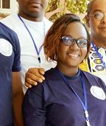
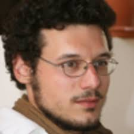

Title: Auteurs de l'étude
Author: MAILLARD Thomas
Date: 2019-05-06

<h3>Les auteurs de l'étude</h3>

<h4>Les chefs de projets</h4>

	
	

		

		
<strong>BROU Yves Oscar Kouadio</strong>

		
Ingénieur Spécialisé Eau et Environnement Brou Oscar dirige le volet technique de l'enquête ETUPO à Urgence Eau Côte d'Ivoire depuis septembre 2018.

		

	

	
	

		

		
<strong>SORO Doba</strong>

		
Docteur en socioanthropologie, Soro Doba dirige le volet socioanthropologique de   l'enquête ETUPO à Urgence Eau Côte d'Ivoire depuis septembre 2018.

		

	

<h4>Les assistants de recherche</h4>

	
	

	

	
<strong>OUATTARA Mafine</strong>

	
OUATTARA Tenin Mafine étudiante en sociologie et anthropologie du développement. Mafine s'intéresse au développement communautaire, au question du genre et leadership féminin, à l'accès des femmes à l'eau potable. Mafine est passionnée de l'infographie, par la nouvelle technologie ( le digital). Elle est engagée pour l'atteinte des ODD en Côte d'Ivoire.
Elle a travaillé a Urgence Eau Côte d'Ivoire entant qu'assistante de recherche de octobre 2018 à Mai 2019, elle est aussi secrétaire générale Adjointe au bureau Pays D'Urgence Eau Côte d'Ivoire

faceboock : <a href="www.facebook. com/madelamafine.Ouattara">Mafine Ouattara</a> 

	
	
	

	

	

	
<strong>KOHE Christelle</strong>

	
Géographe, Kohe Christelle a travaillé a Urgence Eau Côte d'Ivoire en tant qu'assistante de recherche de octobre 2018 à Mai 2019 

	
	
	

	

	

	
<strong>DIAKITE Cheick</strong>

	
DIAKITE Cheick Amadou est doctorant en sociologie et anthropologie de la santé à l’Université Alassane Ouattara en Cote d’ivoire. 
Il a travaillé a URGENCE EAU COTE D’IVOIRE,  de octobre 2018 à Mai 2019, dans le cadre d’une étude socio anthropologique sur l’accès à l’Eau potable, l’hygiène et l’assainissement en milieu urbain et rural. En tant que assistant de recherche, son travail consiste à diagnostiquer les problèmes d’accès à l’Eau potable dans les communautés rurales et urbaines. Il s’intéresse également à la communication des ONG dans le but de vulgariser les résultats de travaux de recherche. 
Enfin il est  bloggeur  c’est-à-dire qu’il réalise des vidéos sur Youtube et Wordpress sur les thématiques de la sociologie et de la vie sociale en général.

	<ul><li>Email : <a href="mailto:cheickdiakite002@gmail.com">cheickdiakite002@gmail.com</a></li>
		<li>Facebook : Cheick Diakité</li>
		<li>Linkedin : Cheick Diakité</li>
		<li>Blog : <a href="https://socioconsulte.wordpress.com">https://socioconsulte.wordpress.com</a></li> 
		<li>Youtube : <a href="https://www.youtube.com/channel/UCnP_s1m3RyMqe6_E4z-rSGQ/videos">https://www.youtube.com/channel/UCnP_s1m3RyMqe6_E4z-rSGQ/videos</a> </li></ul>
	
	
	

	

	

	
<strong>SERI Jonathan</strong>

	
Socioanthropologue, il a travaillé a Urgence Eau Côte d'Ivoire comme assistant de recherche de octobre 2018 à Mai 2019

	
	
	

	
<h4>La cartographie et l'édition Web</h4>

	

		

	
			

			

	<strong  style="display:inline-block;">MAILLARD Thomas</strong>
	

	
Thomas MAILLARD est docteur en Géographie de l'Université Paris 8 et chercheur associé au laboratoire LADYSS (CNRS UMR 7533). 
Il travaille actuellement pour Urgence Eau comme cartographe et géomaticien. Il vient appuyer le travail d'analyse et de publication des résultats de l'étude. 
Il s'intéresse en particulier à l'utilisation de la carte pour faciliter l'implication des habitants et de la société civile dans les procédures de concertation et de participation. À ce titre, il a créé un cours de cartographie participative à l'Université Paris 8 en 2015 et l'a enseigné pendant 3 ans. Cet intérêt est née lors de son doctorat à Saint-Louis (Sénégal) traitant de la participation des habitants à l'aménagement de leur quartier dans la couronne agricole périphérique de la commune.
 Ses recherches actuelles portent sur les thèmes du Droit à la ville, des démarches participatives, de l'agriculture urbaine et de l'accès à l'eau potable et à l'assainissement en Afrique sub-saharienne.

	<ul><li>Page professionnelle : <a href="http://www.ladyss.com/thomas-maillard">http://www.ladyss.com/thomas-maillard</a></li>
<li>Publications sur HAL SHS : <a href="https://cv.archives-ouvertes.fr/thomas-maillard">https://cv.archives-ouvertes.fr/thomas-maillard</a></li>>
<li>Researchgate : <a href="https://www.researchgate.net/profile/Thomas_Maillard2">https://www.researchgate.net/profile/Thomas_Maillard2</a></li></ul>	

			
			

			

			

	
<strong>N'GUESSAN Kouakou Firmain</strong>

	
Firmain Kouakou N'GUESSAN est doctorant en Géographie à l'Université Alassane Ouattara de Bouaké (Côte d'Ivoire). 
Il travaille actuellement pour Urgence Eau comme cartographe avec Thomas MAILLARD. Il vient appuyer le travail de MAILLARD pour l'analyse des faits urbains et de publication des résultats de l'étude. 
Il a fini la rédaction de sa Thèse qui porte sur l'Occupation de l'espace urbain de Bouaké et attend sa soutenance dans les mois avenir. Il a également travaillé comme cartographe avec l'ONG AVSI dans le cadre du projet ''Triangle Pacific'' de septembre 2016 à février 2017. 
Plusieurs publications scientifiques, colloques et autres activités scientifiques sont à son actif. 

	
Pour le contacter : <a href="mailto:kouakoung@yahoo.fr">kouakoung@yahoo.fr</a>

	
	
			

	

