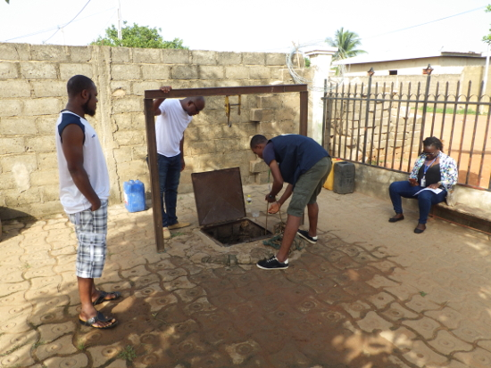

title: Méthodes de diagnostic
template: methodes
category: menu
date: 2019-05-06
authors: BROU Yves Oscar Kouadio, SORO Doba

<h2>Méthodologie</h2>

L'étude préalable de l'accès à l'eau potable et à l'assainissement a été mené dans 62 localités : 8 quartiers de Bouaké et 54 villages aux alentours.  Le travail d'enquête se déroule sur deux volets:

<ul>
<li>

un volet technique : l'analyse de l'état des points d'eau et de la qualité de l'eau,

</li>
<li>

un volet socioanthropologique : le recueil des avis, desiderata et l'analyse des rapports à l'eau et des modes de gestion des points d'eau.

</li>
</ul>
<h3>Echantillonnage</h3>
<table>
<thead>
<tr>
<th align="left">Milieu</th>
<th align="left">Localités</th>
<th align="left">Volet technique</th>
<th align="left">Volet socio- anthropologique</th>
</tr>
</thead>
<tbody>
<tr>
<td align="left">Urbain</td>
<td align="left">8 quartiers</td>
<td align="left">177 points d'eau</td>
<td align="left">450 entretiens</td>
</tr>
<tr>
<td align="left">Rural</td>
<td align="left">54 villages</td>
<td align="left">94 points d'eau</td>
<td align="left">216 entretiens</td>
</tr>
</tbody>
</table>

<figure>

<figcaption>Les analyses techniques sur le terrain et en laboratoire</figcaption>
</figure>

<figure>

<figcaption>Les enquêtes socioanthropologiques : entretiens individuels et focus group</figcaption>
</figure>

<h3>Analyse technique des points d'eau</h3>

L'analyse technique des points d'eau menée sous la direction de l'ingénieur Brou Yves Oscar Kouadio se décompose en deux parties : 
le diagnostic de vulnérabilité sanitaire du point d'eau et l'analyse de la qualité de l'eau.

<table>
<thead>
<tr>
<th align="left">Diagnostic</th>
<th align="left">Paramètres observés</th>
</tr>
</thead>
<tbody>
<tr>
<td align="left"><strong>Informations générales sur le point d'eau</strong></td>
<td align="left">Date de construction, coordonnées géographique, emplacement, type de point d'eau, profondeur, niveau statique, description de la superstructure, type d'exhaure,tarrissement, droit d'accès, état du matériel de pompage ou d'exhaure manuel</td>
</tr>
<tr>
<td align="left"><strong>Diagnostic de vulnérabilité sanitaire :</strong> Analyse de l'état général du point d'eau</td>
<td align="left">Etat de la sperstructure (margelle, dalle anti-bourbier,trottoir, clôture, couvercle, canal de draînage, étanchéité), propreté des outils d'exhaure, de transport et de stockage de l'eau, source de pollution visible dans un rayon de 30 mètres</td>
</tr>
<tr>
<td align="left"><strong>Diagnostic de la qualité de l'eau :</strong> Analyse organoleptique, physicochimique et bactériologique de l'eau</td>
<td align="left">Couleur, Goût, Odeur, pH, Conductivité, turbidité, température, concentration de certains éléments chimiques (chlore libre, chlore total, ammoniac, nitrate, nitrite, arsenic, fluor), Comptage des bactéries <em>Escherichia Coli</em></td>
</tr>
</tbody>
</table>

<h3>Etude socioanthropologique</h3>

L'étude socioanthropologie menée sous la direction du docteur Soro Doba, s'appuie sur une vaste enquête ménage complété par de nombreux entretiens avec des personnes ressources (responsables communautaires et religieux) et des focus group auprès de certaines catégories de la population (femmes, hommes, jeunes). Elle aborde quatre thèmes:

<ul>
<li>

<strong>Les usages de l'eau des ménages:</strong> usage des points d'eau, perception de la qualité de l'eau, désidérata concernant les équipements en eau.

</li>
<li>

<strong>L'assainissement dans les ménages:</strong> équipements d'assainissement, pratique d'évacuation des eaux usées et pratiques de défécation.

</li>
<li>

<strong>Mode de gestion des points d'eau:</strong> type d'organisation, mode de fonctionnement, problèmes rencontrés, tension autour de l'eau.

</li>
<li>

<strong>Niveau d'équipement de la localité:</strong> type d'équipement d'assainissement, état des pompes, types de points d'eau.

</li>
</ul>

 

